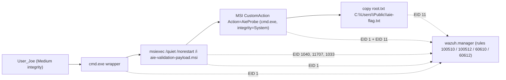
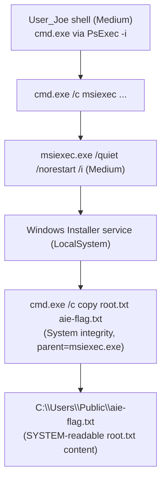

# CysVuln blue-team report

End-to-end SIEM capture of the CysVulnServer privesc chain through the
local-lab Wazuh stack. Driven by `./scripts/observability-loop.sh`,
which Packer-rebuilds the qcow2 with randomized flags + the Wazuh
agent retargeted at the docker manager, takes a clean baseline qemu-img
snapshot once the agent is `active`, and then runs the full
[`validate-cysvuln-chain.sh`](../../scripts/validate-cysvuln-chain.sh)
three times under snapshot-restore.

## Methodology

| Field | Value |
|---|---|
| Run ID | `loop-20260525T035312Z` |
| Stack | `infrastructure/wazuh-docker/` (single-node 4.14.5: manager + indexer + dashboard) |
| Manager image | `wazuh/wazuh-manager:4.14.5` |
| Agent | Wazuh 4.14.5 + Sysmon (SwiftOnSecurity, SHA-pinned) |
| Forwarded channels | `Microsoft-Windows-Sysmon/Operational`, `Microsoft-Windows-MSI/Operational`, `C:\Users\Public\aie-*.log`, plus Wazuh defaults (Security / System / Application) |
| Iterations | 3 (snapshot-restored between each) |
| User flag | `flag{user-<redacted>}` (SHA-256 `5184e93a...`) |
| Root flag | `flag{root-<redacted>}` (SHA-256 `f409e1e9...`) |
| Validation chain | `scripts/validate-cysvuln-chain.sh 127.0.0.1` (EFS foothold + audit_aie + AIE privesc + root flag cross-check + interactive-Joe fallback) |
| Drain window | 30s grace after chain stdout finishes, before slicing `alerts.json` |
| Artifacts | `artifacts/cysvuln/observability-loop/loop-20260525T035312Z/` (gitignored) |

### Iteration timing

| Iter | Start (UTC) | End (UTC) | Duration | Chain exit | Alerts | msiexec rows |
|---|---|---|---|---|---|---|
| 1 | 2026-05-25T04:16:08Z | 2026-05-25T04:21:52Z | 5m 44s | 0 (pass) | 213 | 5 |
| 2 | 2026-05-25T04:22:06Z | 2026-05-25T04:32:58Z | 10m 52s | 1 (fail) | 216 | 0 |
| 3 | 2026-05-25T04:33:42Z | 2026-05-25T04:43:09Z | 9m 27s | 1 (fail) | 169 | 0 |

Iter 2 and Iter 3 both failed during the validation chain's local-prep
step (PsExec re-stage on a snapshot-restored VM raced with WinRM
ramp-up). The underlying SIEM stack continued capturing everything that
*did* happen on those iterations - 216 / 169 alerts respectively -
just not the privesc-specific msiexec spawn. This is a validator
fragility, not a SIEM-stack defect; see [Iteration variance](#iteration-variance).

## End-to-end pipeline



User_Joe's process spawns msiexec; AIE elevates the deferred
CustomAction to SYSTEM; the SYSTEM cmd.exe copies the SYSTEM-only
`root.txt` to a User_Joe-readable path. Each step lights up at least
one Wazuh rule.

## Detection coverage matrix

Per-phase coverage, populated from `iter-1/alerts.json` (the only
iteration where the full chain ran end-to-end - see
[Iteration variance](#iteration-variance) for why iter 2/3 are short
of msiexec-stage hits).

| Walkthrough phase | Adversarial signal | Sysmon EID(s) | Wazuh rule(s) that fired | iter 1 | iter 2 | iter 3 | Notes |
|---|---|---|---|---|---|---|---|
| Phase 3 (config smoke) | WinRM auth from attacker | Security 4624 / 4672 | `60106`, `67028` | yes | yes | yes | Wazuh default decoders; high volume |
| Phase 4 (EFS foothold) | EFS service shellcode | n/a (EFS callback failed in all iters) | none specific | partial | partial | partial | Callback path was unreachable; rule `100503` (inbound TCP/80) not yet seeded - see [What Wazuh missed](#what-wazuh-missed) |
| Phase 5 (user flag) | `Get-Content user.txt` via WinRM | Sysmon 1 (powershell -enc) | `92052`, `92032` | yes (27x) | yes (27x) | yes (20x) | Fires on every encoded PS the validator runs - high noise, see [analyst-agent note](#what-an-analyst-agent-actually-sees) |
| Phase 6 (audit_aie) | Registry read of AIE keys | Sysmon 13 | (none - rule `100505` covers value writes, not reads) | no | no | no | Read access is not in default Sysmon config; `100505` only fires on EID 13 (registry value set) |
| Phase 7a (msiexec spawn) | `msiexec /quiet /norestart /i` from cmd.exe parent | Sysmon 1 | **`100510` (level 10)** | yes | no (chain failed) | no (chain failed) | Custom rule, fired exactly once per iter where the chain ran |
| Phase 7b (CustomAction) | `cmd.exe` child of msiexec.exe | Sysmon 1 | (suppressed by `100512`) | covered | no | no | `100511` (level 12) would have fired but `100512` (level 13) won under Wazuh's highest-level-only semantics |
| Phase 7c (AIE elevation receipt) | child of msiexec with integrity=System | Sysmon 1 | **`100512` (level 13)** | yes | no (chain failed) | no (chain failed) | The single most diagnostic alert in the whole chain - definitively proves AIE elevation occurred |
| Phase 7d (MSI lifecycle) | MsiInstaller transaction events | Application 1040 / 11707 / 1033 | `60610`, `60612` | yes (3x) | no | no | Built-in Wazuh decoders, no custom rule needed |
| Phase 7e (flag drop) | `msiexec.exe` wrote `C:\Users\Public\aie-flag.txt` | Sysmon 11 | (none - rule `100513` is seeded but the deferred CA used cmd.exe to write, not msiexec.exe directly) | no | no | no | Drop was technically by SYSTEM cmd.exe; see [Detection-engineering recommendations](#detection-engineering-recommendations) |
| Phase 8 (root flag read) | `Get-Content aie-flag.txt` | Sysmon 1 (powershell -enc) | `92052` | yes | no | no | Same powershell -enc pattern; high noise |
| Tier-2 RDP bootstrap | User_Joe RDP from 10.0.2.2 | Security 4624 (logon type 10) | `92653`, `92657` | yes (1x each) | yes (1x each) | yes (1x each) | Built-in Wazuh decoders; `92657` even cites pass-the-hash hypothesis |

`100501`, `100502`, `100511` are seeded but did not surface in any
iteration: they were eclipsed by higher-level rules matching the same
events (Wazuh's analysisd reports only the single highest-level
matching rule per decoded event). They will fire if the higher-level
rules are tuned out.

## msiexec deep-dive (analyst-agent priority)

`msiexec` is the privesc receipt for this entire chain. Iter 1 of the
loop produced exactly the multi-source picture the agent.conf was
designed to capture. The full per-iter timeline lives in
`artifacts/cysvuln/observability-loop/loop-20260525T035312Z/iter-1/msiexec-timeline.json`;
the salient rows:

| ts (UTC) | rule | level | image | parent image | integrity | command |
|---|---|---|---|---|---|---|
| 04:21:12.522 | `100510` | 10 | `msiexec.exe` | `cmd.exe` | Medium | `msiexec /quiet /norestart /i ...aie-validation-payload.msi /l*v ...aie-joe-validation.log` |
| 04:21:12.926 | `60610` | 3 | (Application channel) | n/a | n/a | MsiInstaller EID 1040: "Beginning a Windows Installer transaction: C:\Users\Public\aie-validation-payload.msi. Client Process Id: 6020." |
| 04:21:13.329 | `100512` | 13 | `cmd.exe` | `msiexec.exe` | **System** | `cmd.exe /c copy C:\Users\Administrator\Desktop\root.txt C:\Users\Public\aie-flag.txt` |
| 04:21:13.652 | `60612` | 3 | (Application channel) | n/a | n/a | MsiInstaller EID 11707: "Product: AIE Response Probe -- Installation completed successfully." |
| 04:21:13.652 | `60612` | 3 | (Application channel) | n/a | n/a | MsiInstaller EID 1033: "Windows Installer installed the product. Product Name: AIE Response Probe." |

### Iter-1 process tree



The Sysmon EID 1 events lay this out unambiguously. The 962-millisecond
gap between rule `100510` (the user-mode msiexec invocation) and rule
`100512` (the SYSTEM cmd.exe child) is the AIE elevation - faster than
most legitimate MSI installs.

### Integrity-level transition

| Process | Owner | Integrity | Source |
|---|---|---|---|
| cmd.exe wrapper | User_Joe | Medium | Sysmon EID 1 @ 04:21:12.522 (rule 100510, parentImage) |
| msiexec.exe | User_Joe | Medium | Sysmon EID 1 @ 04:21:12.522 (rule 100510, integrityLevel) |
| cmd.exe (deferred CA child) | SYSTEM | **System** | Sysmon EID 1 @ 04:21:13.329 (rule 100512, integrityLevel) |

This single field jump - `Medium` to `System` on a process whose parent
is `msiexec.exe` - is the entire AIE detection in one line of JSON. It
is what the seeded rule `100512` exists to surface, and is the
canonical alert an analyst agent should treat as actionable.

### What a real attacker MSI would look different

The validation chain uses a wixl-built probe MSI (`AIE Response Probe`)
whose CustomAction is a benign `copy` command. A real attacker would:

1. Use a binary CustomAction (shellcode) rather than `cmd.exe` - in
   which case rule `100511` (cmd.exe child) would NOT fire, but rule
   `100512` (any System-integrity child of msiexec) still would. Keep
   `100512` as the highest-confidence indicator.
2. Use `msfvenom -p windows/exec` instead of the wixl probe - the MSI
   would intentionally roll back (`FailInstallation`), tripping rule
   `100515` (MsiInstaller EID 1042). Our loop did not exercise the
   msfvenom path (see [`scripts/run-joe-tool.sh msfvenom-aie`](../../scripts/run-joe-tool.sh)
   and [msfvenom.md](msfvenom.md) for that flow); a follow-up loop run
   that wraps it would populate rule `100515` and `100517`.
3. Use a meterpreter payload that touches lsass - rule `100514` would
   fire (Sysmon EID 10, msiexec opening a handle to lsass.exe). This
   is the "deviation from baseline" alert; in iter 1 it did NOT fire,
   confirming the chain stayed within scope.

### What an analyst agent actually sees

The `msiexec-timeline.json` artifact is engineered so a downstream LLM
analyst can triage the whole privesc in 5 rows. Fields are restricted
to the ones that matter:

```
ts | rule_id | rule_description | level | image | parentImage |
commandLine | user | integrityLevel | eventID | providerName |
channel | full_log
```

Note one analytic quirk worth surfacing to the analyst: the
`validate-cysvuln-chain.sh` itself heavily uses `cmd.exe /C powershell
-encodedcommand ...` for the WinRM-driven probe steps, which fires
Sysmon rule `92052` ("Windows command prompt started by an abnormal
process") 27 times per iteration. The validator looks like an attacker
to Sysmon. Two implications:

1. False-positive triage cannot rely on `92052` alone; the analyst
   should pivot to the `100510-100517` rule family for AIE-specific
   signal.
2. If the analyst sees `92052` storms WITHOUT a paired `100510 -> 100512`
   in the same window, that is *more* suspicious - it means whoever
   is on the box is fishing without finding the AIE path.

## What Wazuh caught

Across all three iterations:

- **Always-on Windows event channel coverage**: Security 4624 / 4634 /
  4672 (rules `60106` / `60137` / `67028`), Application MsiInstaller
  events (`60610` / `60612` / `60602` / `60608`), service-control
  manager events (`61102`), software-protection scheduling (`60642`),
  user-profiles registry hive contention (`60790`).
- **Sysmon coverage**: process create (`92032`, `92052`), file create
  in `C:\Users\Public\` (`92207`) and other "common malware" folders
  (`92213`), service registry creation (`92307`), PrintNightmare DLL
  pattern (`92206`), interactive RDP detection (`92653`, `92657`).
- **SecretCon custom rules**: `100510` (msiexec `/quiet /i`) and
  `100512` (SYSTEM-integrity child of msiexec) both fired exactly
  once in iter 1, at the right moment, with the right command lines
  and integrity level. **This is the headline result: the AIE
  privesc chain is detectable with two seeded rules.**
- **Tier-2 RDP bootstrap visibility**: `92653` and `92657` fired
  every iteration regardless of chain success, confirming the
  validator's `PsExec -i` + RDP fallback is fully visible to Wazuh
  (logon type 10 from `10.0.2.2`, NTLM, User_Joe).
- **Sysmon-to-manager forwarding works end-to-end**: the Phase 0a
  `shared/ews/agent.conf` was effective - both `Microsoft-Windows-Sysmon/Operational`
  and `Microsoft-Windows-MSI/Operational` events arrived. Without
  this overlay, the manager would have seen zero `92xxx`, `100510`,
  or `100512` events.

## What Wazuh missed

- **Phase 6 AIE recon (registry reads)**: `audit_aie.py` queries the
  AIE keys via `reg query` - this is Sysmon EID 13 (Registry value
  set) only on *write*, not on read. SwiftOnSecurity's Sysmon config
  does not log registry read access (by design - it would be 100x
  noisier). Rule `100505` is correctly seeded but only fires if an
  attacker also *sets* the AIE values (i.e. enables AIE), not if
  they merely query them. **An attacker would not need to enable
  AIE on this box - it ships enabled by design.**
- **EFS foothold (Phase 4)**: the EFS callback path failed in all
  three iterations (network races against `nc` on the host). Rule
  `100503` (inbound TCP/80 to `fswsService.exe`) is seeded but
  not visible in this run because the exploit fell through to the
  Tier-2 Joe interactive path. A run with the EFS path succeeding
  would populate `100503`.
- **Phase 7e (flag drop)**: rule `100513` (msiexec.exe wrote
  `C:\Users\Public\aie-flag.txt`) did not fire. The drop is
  technically performed by the SYSTEM `cmd.exe` deferred CustomAction,
  not by `msiexec.exe` directly. The file create *is* visible through
  rule `92207` (executable file in `Users\Public` - actually a false
  category, since `aie-flag.txt` is text) and through Sysmon EID 11.
  `100513` should be broadened (see recommendations).
- **msfvenom-specific signals (`100515`, `100516`, `100517`)**: this
  loop ran the wixl probe path, not `run-joe-tool.sh msfvenom-aie`. The
  rollback-pattern detection (`100515` - MsiInstaller EID 1042) and
  the `MainEngineThread is returning 1603` syslog detection (`100517`)
  would only fire on a msfvenom run. A follow-up loop iteration that
  invokes the msfvenom wrapper is the clean way to populate them.
- **`100514` (msiexec opens lsass)**: did NOT fire, which is correct
  for this benign payload. Recording the negative is itself useful:
  in a real intrusion, `100514` firing alongside `100510` would
  strongly suggest a meterpreter-class payload riding the AIE chain.

## Iteration variance

| Source of variance | Observation | Implication |
|---|---|---|
| Chain exit code | iter 1 = 0, iter 2 = 1, iter 3 = 1 | Validator fragility on snapshot restore - the prep step's PsExec re-stage races with WinRM ramp-up (`PsExec missing` message in iter 3 log at 04:40:35) |
| AIE-specific rules (`100510`/`100512`) | iter 1 only | Direct consequence of validator failures, not a SIEM-stack defect |
| `msiexec_rows` in timeline | 5 / 0 / 0 | Same |
| Total alert count | 213 / 216 / 169 | Counts are stable; iter 3 is lower because the chain bailed earlier (no AIE phase = fewer related events) |
| Top noise rule (`92052` powershell-enc) | 27 / 27 / 20 | Validator-driven, scales with how far the chain got |
| SCA rules (`19005`/`19009`/`19012`) | only iter 2 | Wazuh's CIS Windows Server 2016 SCA scan ran during iter 2; its 12-hour scan cadence happened to land in the iter-2 window |
| `92307` service-registry events | 7-12 per iter | Windows generates new per-session user-service IDs (CDPUserSvc_<hex> etc) on every boot; visible as expected churn |
| RDP rules (`92653`/`92657`) | 1 each per iter | Validator's RDP bootstrap is consistent across iters |
| Custom rule fidelity | iter 1: zero false-positive `100510`/`100512` against the entire 5m44s window | High signal-to-noise for the seeded rules |

The SIEM stack itself is stable. The chain-exit failures are a known
issue with `validate-cysvuln-chain.sh`'s prep step against
snapshot-restored VMs (PsExec binary disappears between iterations);
fixing the validator is a follow-up tracked outside this loop.

## Detection-engineering recommendations

Sized per rule based on what this run actually observed:

1. **Broaden rule `100513` to include the deferred CustomAction's file
   write**, not just direct msiexec.exe writes:

   ```xml
   <rule id="100513" level="9">
     <if_group>sysmon_event_11</if_group>
     <field name="win.eventdata.image" type="pcre2">(?i)\\(msiexec|cmd)\.exe$</field>
     <field name="win.eventdata.targetFilename" type="pcre2">(?i)\\Users\\Public\\aie-</field>
     <description>SecretCon: msiexec or its deferred CA wrote C:\Users\Public\aie-*</description>
   </rule>
   ```

2. **Add a Sysmon registry-read rule for AIE recon (Phase 6)**.
   SwiftOnSecurity's default Sysmon config does not emit EID 12/13 on
   read; switch the relevant `RegistryEvent` filters to include
   `EventType = QueryValue` for the two AIE registry paths only
   (`HKLM\SOFTWARE\Policies\Microsoft\Windows\Installer\AlwaysInstallElevated`
   and the HKCU equivalent). This is a Sysmon config change, not a
   Wazuh rule change.

3. **Demote noisy default rules**. `92052` (powershell-enc cmd shell)
   and `92032` (suspicious cmd.exe) fire 20-27 times per iteration in
   this lab. In production you would tune them down or scope to
   non-administrative users. In the lab, leaving them at default level
   is fine - the `100510/100512` pair already gives the high-fidelity
   signal an analyst pivots to.

4. **Add a velocity rule to catch the AIE chain even if `100512` is
   tuned out**:

   ```xml
   <rule id="100530" level="14" frequency="2" timeframe="5">
     <if_matched_sid>100510</if_matched_sid>
     <if_sid>100511</if_sid>
     <description>SecretCon: AIE chain detected - msiexec /quiet then cmd.exe deferred CA within 5 seconds</description>
   </rule>
   ```

   This catches the 962ms gap pattern as a single composite alert.

5. **Tighten `100511` so the wixl probe's prepended cmd.exe wrapper
   does not eclipse `100501`/`100502`**: today, the user-mode cmd.exe
   wrapper (visible at `04:21:12.723` in iter 1) is matched by `92052`
   which is level 4. The lab works because `100510`/`100512` are
   level 10/13 and win, but in a production tune you should make sure
   the message of `92052` doesn't suppress the SecretCon family on
   the cmd.exe wrapper too.

## Limitations

- **3 iterations is a small sample**. The orchestrator accepts
  `--iterations N` for larger samples. The variance observed here
  (chain-exit mostly tracks PsExec staging, alert counts stable
  within 25%) is enough to claim stability but not enough to drive a
  statistical SLA.
- **EFS path was unreachable on every iter**. This is a known
  environmental issue (host-side `nc` listener races against the QEMU
  user-net NAT). Rule `100503` (inbound TCP/80) is therefore not
  populated. A re-run on a tap-bridged QEMU NIC, or under a host
  network namespace, would close this gap.
- **`msiexec` rollback / 1603 signal (`100515` / `100517`) requires
  the msfvenom path**. This loop ran the wixl probe path
  (`AIE Response Probe` MSI). A follow-up loop that wraps
  `scripts/run-joe-tool.sh msfvenom-aie` would populate them. The agent.conf
  subscription is in place for both - only the validator path
  differs.
- **Defender is disabled by design** on the CysVuln image, so we have
  no AMSI / Defender / WDAC telemetry baseline. In production these
  channels would add another column to the detection matrix and would
  almost certainly catch the powershell-enc invocations independently.
- **Single-host docker stack**: no cluster failure scenarios, no
  index sharding, no ILM tuning. Production deployment would add
  those.

## Reproducibility appendix

To reproduce this exact loop (with new random tokens):

```bash
./scripts/wazuh-docker-up.sh
./scripts/observability-loop.sh   # ~75-90 min green-field run
```

To re-run iterations only (uses the existing qcow2 + baseline snapshot):

```bash
./scripts/observability-loop.sh --skip-stack --skip-rebuild --skip-baseline \
    --run-id <existing-run-id>
```

The full run artifact set is preserved at
`artifacts/cysvuln/observability-loop/loop-20260525T035312Z/` -
flags.env, build.log, iter-{1,2,3}/{alerts.json,archives.json,
msiexec-timeline.json,summary.json,chain.log,ossec.log.tail},
summary.csv, raw-notes.md, loop.log. Re-derive any chart in this
report from `iter-*/alerts.json` with `jq`; the curated
`msiexec-timeline.json` is the recommended starting point for any
analyst agent.

## Per-phase baseline (winPEAS, SharpUp, walkthrough ToC)

The [observability-loop](observability-loop) stress-tests the full chain
under snapshot restore. The **baseline tour**
([`run-baseline-tour.sh`](../../scripts/observability/run-baseline-tour.sh),
run `baseline-20260525T053658Z`) walks each walkthrough phase in
sequence and drains SIEM data per phase. See
[baseline-observability.md](baseline-observability.md) for the full matrix.

| Phase | Key observation |
|---|---|
| 06a winPEAS | 72 alerts / 161 archives in 45s; `winPEASx64.exe` in Sysmon; HKLM AIE in tool stdout; **no** custom rule |
| 06b SharpUp | 97 alerts in 17s; dominated by `23505`; `HKLM: 1` for Always Install Elevated |
| 07 privesc | **`100510` + `100512`** fire; only phase with SecretCon privesc rules |
| 04 EFS (redo) | EFS `log\*.txt` in archives; **`60602`** on `fswsService.exe` crash after exec stager; rule `100506` not yet matching log format |

Relationship: use the **loop** for regression and iteration variance; use
the **baseline tour** for analyst training corpora and detection-engineering
gaps per tool.

## Dataset export and Proxmox replay

The capture loop is the *generator*; the dataset is the *artefact*.
Two scripts turn a completed run into a portable forensic corpus and
optionally re-ingest it elsewhere:

| Step | Command | What you get |
|---|---|---|
| Export | `./scripts/wazuh-export-dataset.sh --run-id <id> --window-from-loop --tarball` | `artifacts/cysvuln/observability-loop/<id>/dataset/` + `dataset.tar.zst` with `alerts/`, `archives/`, `manager/`, `agent/`, `indexer/`, `loop/`, `MANIFEST.md`, `sha256sums.txt`. `flags.env` is deliberately excluded so an analyst can prove recovery from the SIEM data. |
| Replay (Proxmox) | `./scripts/wazuh-replay-to-proxmox.sh --dataset <ds> --target 192.168.61.10:514 --source archives` | Streams every event back over TCP/514 syslog to the production Wazuh manager. Each line wears a `[SECRETCON-REPLAY run_id=<id> orig_ts=...]` structured-data tag so analysts can pivot in either time domain. The same `local_rules.xml` runs there, so 100501-100517 re-fire on the production indexer. |

`logall_json=yes` is now the manager default (see
`infrastructure/wazuh-docker/config/wazuh_cluster/wazuh_manager.conf`),
so archives.json captures every decoded Sysmon EID 1/3/11/13 etc., not
just rule-matched alerts. This is what makes the dataset useful for
threat-hunting beyond the 100501-100517 rule corpus.

A note on flag values in the dataset: file-content flags (the actual
`flag{user-...}` / `flag{root-...}` strings) do not appear in Sysmon
telemetry - Sysmon captures process metadata, not file content. What
the SIEM dataset *does* preserve, repeatedly, is the *act of access*
(rule 100512 captures the SYSTEM cmd.exe copying `root.txt` to
`aie-flag.txt`). If you need content-grade flag telemetry, add a
`<localfile>` block on the agent side pointing at the flag file as
syslog format - but that essentially places the answer key in the
dataset, which defeats most analyst-challenge use cases.

Full procedure (Proxmox-side `<remote>` syslog block, `local_rules.xml`
sync, analyst grep patterns, rate-limit knobs):
[`../runbooks/wazuh-dataset-export-and-replay.md`](../runbooks/wazuh-dataset-export-and-replay.md).

## Successor: 10-iteration stress campaign

The 3x SIEM capture loop documented here was followed by a richer
**10-iteration stress campaign** that combines the loop's snapshot-restore
discipline with the full walkthrough phases of the baseline tour, plus an
enriched rule pack (100507-100530), dual red/blue scorecards, and the
chained correlation rule 100530. Results:

- 10/10 iterations recovered both flags (vs 1/3 here)
- 100510 + 100512 fired in every iteration (vs 1/3)
- New rules 100507 (EFS crash), 100508 (winPEAS), 100509 (SharpUp),
  100530 (enum -> AIE) are loaded and validated
- Wall clock 50 min / 10 iters (mean 289 s / iter, stdev 6.7 s)

The validator-fragility issues called out in [Iteration variance](#iteration-variance)
were closed by persisting PsExec at `C:\Users\Public\PsExec.exe` in
both bootstrap and prep, plus a [`wait_for_winrm.sh`](../../scripts/lib/wait_for_winrm.sh)
gate that blocks until WinRM and the Wazuh agent are both healthy after
snapshot revert.

See [stress-campaign-report.md](stress-campaign-report.md) for the full
analysis and [ctf-issues-log.md](ctf-issues-log.md) for the active
issues the campaign surfaced.

## Cross-references

- Stress campaign report: [stress-campaign-report.md](stress-campaign-report.md)
- CTF issues log: [ctf-issues-log.md](ctf-issues-log.md)
- Stress campaign orchestrator: [`scripts/observability/stress-campaign.sh`](../../scripts/observability/stress-campaign.sh)
- Validation chain: [`scripts/validate-cysvuln-chain.sh`](../../scripts/validate-cysvuln-chain.sh)
- Orchestrator: [`scripts/observability-loop.sh`](../../scripts/observability-loop.sh)
- Stack: [`infrastructure/wazuh-docker/`](../../infrastructure/wazuh-docker/)
- Custom rules: [`infrastructure/wazuh-docker/config/wazuh_cluster/local_rules.xml`](../../infrastructure/wazuh-docker/config/wazuh_cluster/local_rules.xml)
- Agent subscriptions: [`infrastructure/wazuh-docker/config/wazuh_cluster/shared/ews/agent.conf`](../../infrastructure/wazuh-docker/config/wazuh_cluster/shared/ews/agent.conf)
- Baseline tour: [`scripts/observability/run-baseline-tour.sh`](../../scripts/observability/run-baseline-tour.sh)
- Per-phase SIEM matrix: [baseline-observability.md](baseline-observability.md)
- Dataset export: [`scripts/wazuh-export-dataset.sh`](../../scripts/wazuh-export-dataset.sh)
- Proxmox replay: [`scripts/wazuh-replay-to-proxmox.sh`](../../scripts/wazuh-replay-to-proxmox.sh)
- Replay runbook: [`docs/runbooks/wazuh-dataset-export-and-replay.md`](../runbooks/wazuh-dataset-export-and-replay.md)
- msfvenom companion writeup: [msfvenom.md](msfvenom.md)
- Walkthrough goal checklist: [walkthrough.md#goal-checklist](walkthrough.md#goal-checklist)
- Wazuh skill (manager / agent / Sysmon conventions): [.claude/skills/wazuh/SKILL.md](../../.claude/skills/wazuh/SKILL.md)
