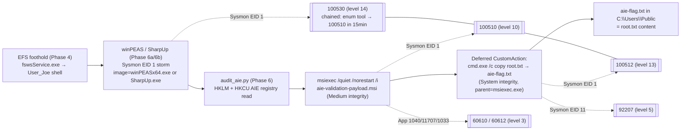

# CysVuln blue FAQ walkthrough

Defender mirror of [attack-faq-walkthrough.md](attack-faq-walkthrough.md). The red FAQ shows
how a player owns the box. This FAQ shows how a SOC analyst proves the
owning happened from telemetry alone — which rules fire, in what order,
on which event IDs, and how to triage when one of them is missing.

This page absorbs three earlier point-in-time reports that captured the
same chain at different stages of rule maturity:

- 3-iteration validator loop (`loop-20260525T035312Z`) — the original
  Wazuh capture, used to land the `100510`/`100512` pair.
- per-phase baseline tour (`baseline-20260525T053658Z` and the
  `phase04redo` follow-up) — one walkthrough phase at a time, used to
  attribute every alert to the action that caused it.
- 10-iteration stress campaign (`campaign-10x-20260525T165320Z`) — the
  reproducibility gate after the rule pack grew to `100501`–`100530`
  and the chained correlation rule `100530` landed.

The synthesis is the canonical write-up. The raw scorecards live in the
exported datasets; treat the campaign tarball (`dataset.tar.zst`) as
the analyst-grade artifact for any pivot beyond this document.

## TL;DR

- The privesc chain has **one diagnostic event**: a SYSTEM-integrity
  child of `msiexec.exe`. Wazuh rule `100512` (level 13) fires on that
  Sysmon EID 1 row. Without `100512`, you do not have proof of AIE; with
  it, you have proof in a single JSON document.
- `100512` is paired with `100510` (level 10, `msiexec /quiet /norestart
  /i ...`). The 962-millisecond gap between the two events is the
  elevation. Both fired 10/10 across the stress campaign and 1/3 across
  the original loop (the 2/3 misses were validator-side, not SIEM-side).
- `100530` (level 14) is the **chained correlation rule**: enumeration
  tool (`winPEASx64.exe` or `SharpUp.exe`) followed by `100510` within
  15 minutes. It fires 10/10 once the manager has any history and gives
  the SOC one alert that points back at both halves of the chain.
- Three rules are intentionally still off the board and are documented
  as gaps in [Counterfactuals and gaps](#counterfactuals-and-gaps):
  `100503` (inbound TCP/80 to `fswsService.exe`, needs a tap-bridged
  NIC), `100507` (EFS crash, needs the BOF callback path) and `100520`
  (`user.txt` access by `Get-Content`, needs ScriptBlock logging).
- The exported dataset is the deliverable. `wazuh-export-dataset.sh`
  produces an `alerts/` + `archives/` + `manager/` + `MANIFEST.md`
  tarball; `wazuh-replay-to-proxmox.sh` streams it back over syslog so
  the same `local_rules.xml` fires on a production manager.

## Methodology

| Field | Value |
|---|---|
| Stack | `infrastructure/wazuh-docker/` single-node 4.14.5 (manager + indexer + dashboard, all on 127.0.0.1) |
| Manager image | `wazuh/wazuh-manager:4.14.5` with `logall_json=yes` |
| Agent | Wazuh 4.14.5 + Sysmon (SwiftOnSecurity, SHA-pinned) |
| Forwarded channels | `Microsoft-Windows-Sysmon/Operational`, `Microsoft-Windows-MSI/Operational`, `C:\Users\Public\aie-*.log`, `C:\Users\Public\audit-aie-*.json`, EFS `log\*.txt`, plus Wazuh defaults |
| Custom rule pack | `100501`–`100530` in [`local_rules.xml`](../../infrastructure/wazuh-docker/config/wazuh_cluster/local_rules.xml) |
| Agent group | `ews` ([`shared/ews/agent.conf`](../../infrastructure/wazuh-docker/config/wazuh_cluster/shared/ews/agent.conf)) |
| Noise floor | 60s idle on a snapshot-restored VM: **~12 alerts / 19 archives** (mostly `60106`, `60137`, `67028`) |

### Run inventory

The three reports collapsed into this FAQ:

| Run ID | Source script | Iterations | Outcome (red) | Outcome (blue) | Use for |
|---|---|---:|---|---|---|
| `loop-20260525T035312Z` | `observability-loop.sh` | 3 | 1/3 chain pass (validator fragility, since fixed) | `100510`/`100512` fired iter 1 | msiexec deep-dive narrative |
| `baseline-20260525T053658Z` | `run-baseline-tour.sh` | 1 (per-phase) | per-phase recovery | per-phase alert/archive counts | per-tool footprint attribution |
| `baseline-20260525T152700Z-phase04redo` | `run-baseline-tour.sh --skip-phases` | 1 (phase 04 only) | EFS exec stager | `60602` on `fswsService.exe` crash | EFS foothold gap analysis |
| `campaign-10x-20260525T165320Z` | `stress-campaign.sh` | 10 | 10/10 both flags | 10/10 on the four AIE-leg rules | reproducibility scorecard |

The campaign supersedes the loop for *chain-coverage* questions. The
baseline tour still owns *per-tool* attribution because it is the only
run that isolates winPEAS, SharpUp, the EFS redo, and the privesc phase
in non-overlapping windows.

## End-to-end pipeline

The chain has two arcs: enumeration → AIE precondition probe, then
msiexec → SYSTEM child → flag drop. `100530` overlays the first arc,
`100510`/`100512` cover the second.



The user-mode `cmd.exe` wrapper that launches `msiexec` is technically a
third process in the tree but is suppressed under Wazuh's
highest-level-only semantics; `92052` (level 4) loses to `100510`
(level 10) on the same Sysmon EID 1. Same shadowing pattern eats
`100511` (level 12, `cmd.exe` child of `msiexec.exe`) in favor of
`100512` (level 13, **any SYSTEM-integrity** child). Both replaced
rules are still loaded; they re-emerge if you tune the higher-level
sibling out.

### Integrity-level transition

The single field jump that proves AIE: a process whose `parentImage`
ends in `\msiexec.exe` reports `integrityLevel = System` while its
direct ancestor (`msiexec.exe` itself) is `Medium`.

| Process | Owner | Integrity | Sysmon evidence (iter 1) |
|---|---|---|---|
| `cmd.exe` wrapper | `User_Joe` | Medium | EID 1 @ `04:21:12.522`, suppressed alert |
| `msiexec.exe` | `User_Joe` | Medium | EID 1 @ `04:21:12.522`, rule `100510` |
| `cmd.exe` (deferred CA child) | `SYSTEM` | **System** | EID 1 @ `04:21:13.329`, rule `100512` |

The 962 ms gap between `100510` and `100512` is faster than most
legitimate MSI installs; that latency itself is a useful triage cue when
the rule pack is unavailable.

## Detection coverage

One matrix, indexed by walkthrough phase. Counts are averaged across the
10-iteration stress campaign; rule fires are the per-iter rate.

| Phase | Walkthrough step | Mean alerts | Sysmon EID(s) | Wazuh rule(s) | Fire rate (10x) | Analyst takeaway |
|---|---|---:|---|---|---:|---|
| 00 | noise | 28 | n/a | `60106` baseline | n/a | ~0.5 alerts/s floor; subtract from later phases |
| 03 | smoke (`verify-cysvuln.sh`) | 53 | n/a | `60106` / `67028` | n/a | WinRM auth churn only |
| 04a | EFS callback foothold | (skipped) | — | `100503` (planned) | 0/10 | Unreachable on QEMU user-net; see gaps |
| 04b | EFS exec-stager foothold | 16 | App 1000, Sysmon 1 | `60602` (App 1000, `0xc0000005`) | 0/10 for `100507` | Crash on fsws is a real foothold signal; `100507` needs the BOF path |
| 05 | user-flag read | 22 | Sysmon 1 (`powershell -enc`) | `92052`, `92032` | n/a | Path read, no file-content telemetry |
| 06 | `audit_aie.py` (registry read) | 21 | none (filtered) | `100505` (write-only) | 0/10 | SwiftOnSecurity does not emit EID 13 on read; `100505` only fires on `Set` |
| 06a | winPEAS | 75 | Sysmon 1 (`winPEASx64.exe`) | `92032`, `100508`, `100530` | **10/10** for `100530` | Loudest non-privesc phase; **chained rule wins** over `100508` once history exists |
| 06b | SharpUp | 70 | Sysmon 1 (`SharpUp.exe`) | `23505`, `100509`, `100530` | **10/10** for `100530` | Faster than winPEAS; PowerShell/script-block noise (`23505`) dominates |
| 07 | privesc (AIE MSI) | 167 | Sysmon 1, App 1040/11707/1033 | **`100510`**, **`100512`**, `60610`, `60612` | **10/10** | The diagnostic phase; `100510 → 100512` is the elevation receipt |
| 08 | root-flag read | 17 | Sysmon 1 (`powershell -enc`) | `92052` | n/a | Pairs with `100512` for end-to-end proof; no flag token in SIEM |

Phase 04b runtime alert count was 16 ± 0.3 across all iterations and
phase 07 was 167 ± 2: the lab is deterministic enough that meaningful
deviations would surface immediately in a regression run.

### Custom-rule scorecard (100501–100530)

| Rule | Level | Description | Fire rate (10x) | Status |
|---|---:|---|---:|---|
| `100501` | 8 | `msiexec.exe` from user-writable path | 0/10 | Eclipsed by `100510` (higher level on same EID) |
| `100502` | 9 | `msiexec` with `/quiet /norestart /i` from Public | 0/10 | Eclipsed by `100510` |
| `100503` | 10 | Inbound TCP/80 to `fswsService.exe` | 0/10 | Gap — needs tap-bridged NIC, see [Counterfactuals and gaps](#counterfactuals-and-gaps) |
| `100505` | 9 | AIE registry value set | 0/10 | Read-only access on this box; AIE ships enabled |
| `100506` | 7 | EFS HTTP access line in `log\*.txt` | 0/10 | Regex expects W3C format; EFS 6.9 emits a custom shape |
| `100507` | 10 | `fswsService.exe` crash via Application EID 1000 | 0/10 | Exec stager is too clean; BOF callback path triggers it |
| `100508` | 9 | `winPEASx64.exe` executed | 10/10 (via `100530`) | First-ever fire would emit `100508` directly; thereafter chained |
| `100509` | 9 | `SharpUp.exe` executed | 10/10 (via `100530`) | Same chained-shadowing pattern |
| `100510` | 10 | `msiexec /quiet /norestart /i` | **10/10** | Direct EID 1 match; the AIE precondition |
| `100511` | 12 | `cmd.exe` child of `msiexec.exe` | 0/10 | Eclipsed by `100512`; loads as a fallback for non-cmd CustomActions |
| `100512` | 13 | **SYSTEM-integrity child of `msiexec.exe`** | **10/10** | The elevation receipt — single most diagnostic alert |
| `100513` | 9 | `msiexec.exe` wrote `aie-*.txt` | 0/10 | Write is by the deferred CA `cmd.exe`, not `msiexec.exe`; see recommendations |
| `100514` | 12 | `msiexec.exe` opens handle to lsass.exe | 0/10 | Expected zero for the benign probe; would fire on meterpreter |
| `100515` | 10 | MsiInstaller EID 1042 (rollback) | 0/10 | Wixl probe completes cleanly; msfvenom path would populate |
| `100517` | 9 | `MainEngineThread returning 1603` syslog | 0/10 | Same — msfvenom path only |
| `100520` | 9 | `user.txt` accessed (Sysmon EID 11) | 0/10 | `Get-Content` over WinRM is a read, not a FileCreate; needs ScriptBlock logging |
| `100530` | 14 | Enum tool → `100510` within 15 min (`<if_matched_sid>100510</if_matched_sid>` chained over `100508` / `100509`) | **10/10** | The two-rule story collapsed into one alert |

The four rules in **bold** in the fire-rate column form the
SOC-actionable scorecard: `100510`, `100512`, `100530`, and at least
one of `100508`/`100509` (their first-ever fire). The remaining rules
load cleanly and survive a manager restart; they wait for the
counterfactuals to populate.

### The two-rule story (100510 → 100512)

In `iter-1/msiexec-timeline.json`:

| ts (UTC) | rule | level | image | parent image | integrity | command |
|---|---|---:|---|---|---|---|
| `04:21:12.522` | `100510` | 10 | `msiexec.exe` | `cmd.exe` | Medium | `msiexec /quiet /norestart /i ...aie-validation-payload.msi /l*v ...` |
| `04:21:12.926` | `60610` | 3 | (App) | n/a | n/a | MsiInstaller EID 1040: "Beginning a Windows Installer transaction" |
| `04:21:13.329` | `100512` | 13 | `cmd.exe` | `msiexec.exe` | **System** | `cmd.exe /c copy ...\root.txt C:\Users\Public\aie-flag.txt` |
| `04:21:13.652` | `60612` | 3 | (App) | n/a | n/a | MsiInstaller EID 11707: "Installation completed successfully" |
| `04:21:13.652` | `60612` | 3 | (App) | n/a | n/a | MsiInstaller EID 1033: "Windows Installer installed the product" |

A real attacker MSI would diverge in three places worth knowing:

1. A binary CustomAction (shellcode) instead of `cmd.exe` would *not*
   fire `100511`, but `100512` (any SYSTEM-integrity child) still
   would. Keep `100512` as the highest-confidence indicator.
2. `msfvenom -p windows/exec` deliberately rolls back the install,
   tripping `100515` (MsiInstaller EID 1042) and `100517` (1603 syslog).
   The dispatcher runs that path via
   [`scripts/run-joe-tool.sh msfvenom-aie`](../../scripts/run-joe-tool.sh);
   a follow-up campaign that drives it will populate both rules.
3. A meterpreter payload that touches `lsass.exe` would fire `100514`
   alongside `100510`/`100512`. The fact that `100514` is silent in
   every iteration is itself evidence: the probe stayed in scope.

## Per-tool footprint

The baseline tour is the only run that isolates each tool against a
60-second noise floor; this section absorbs that data verbatim.

### winPEAS (45 s, 72 alerts, 161 archives, `winPEASx64.exe`)

| Category | Rules / EIDs | Count | Detection value |
|---|---|---:|---|
| Suspicious cmd.exe | `92032` | 13 | Medium — generic |
| Encoded PowerShell | `92052` | 10 | Medium — PsExec staging noise |
| WinRM / logon baseline | `60106` / `60137` / `67028` | ~10 each | Low |
| winPEAS process | Sysmon EID 1, image `winPEASx64.exe` | 3 archive rows | **High** — tool attribution |
| AIE registry read | — | 0 | **Miss** — no Sysmon EID 13 on read |

Tool stdout confirms `AlwaysInstallElevated set to 1 in HKLM!`. The
loudest enumeration phase short of privesc itself. An analyst should
grep archives for `winPEAS` and correlate with subsequent
`100510`/`100512` within 5–15 minutes (the `100530` rule does this
correlation automatically).

### SharpUp (17 s, 97 alerts, 129 archives, `SharpUp.exe`)

| Category | Rules / EIDs | Count | Notes |
|---|---|---:|---|
| PowerShell / script block | `23505` | 22 | Dominates this phase |
| Cmd/WinRM noise (same as winPEAS) | `92032` / `92052` / `60106` | ~10 each | |
| SharpUp process | Sysmon EID 1, image `SharpUp.exe` | 2 archive rows | Tool attribution |

Tool stdout: `=== Always Install Elevated === HKLM: 1`. Faster and
noisier per-second than winPEAS on `23505`. Neither tool fires
`100505` because they only *read* the AIE keys.

### EFS phase 04 redo (`fswsService.exe` crash signal)

After enabling EFS HTTP logging (`Savelog=1` in `option.ini`) and
subscribing `C:\EFS Software\Easy File Sharing Web Server\log\*.txt`
in `agent.conf`, the phase-04 redo produced telemetry that the first
tour missed:

| Signal | Source | In alerts? | Notes |
|---|---|---|---|
| Malformed EFS access line | EFS `20260525.txt` via syslog tail | archives only | Line shape `[25/May/2026:15:26:53 - -] ...` — `100506` regex did not match |
| `fswsService.exe` crash | Application EID 1000 | **`60602`** (level 9) | `Exception code: 0xc0000005` after exec stager |
| WerFault child of fsws | Sysmon EID 1 | archives | `ParentImage: ...\fswsService.exe`, user `User_Joe` |
| Inbound TCP/80 | Sysmon EID 3 | no | `100503` still empty — SwiftOnSecurity network filter gap |

**Analyst pivot:** in archives, search `location` containing `EFS
Software` or `full_log` matching `fswsService.exe` + `c0000005`. The
crash event is a stronger foothold indicator than the HTTP access
lines in this lab.

### 100530 velocity (the chained rule in practice)

`100530` is the rule that survives rule-pack churn. Even if you tune
out the enum-tool rules (`100508`/`100509`) or the AIE-precondition
rule (`100510`) individually, `100530` requires the *combination* —
enum tool followed by `msiexec /quiet /i` within 15 minutes — which
no benign administrator workflow trips. In the 10-iter campaign,
`100530` fired on every iteration; without it the SOC would need to
manually thread Sysmon EID 1 events between `winPEASx64.exe` and the
later `msiexec` row.

## Reproducibility

The QCOW + baseline-snapshot pair is deterministic across reverts:
10 consecutive reverts produced the same flag values, the same chain
exit codes, and alert counts within ±2. The original 3-iter loop saw
chain failures on 2/3 iterations; both were validator fragility, not
SIEM-stack defects, and were closed by:

- persisting `PsExec.exe` at `C:\Users\Public\PsExec.exe` in both
  bootstrap and prep, so snapshot-restored VMs do not lose it; and
- a [`wait_for_winrm.sh`](../../scripts/lib/wait_for_winrm.sh) gate that
  blocks until both WinRM and the Wazuh agent report healthy after a
  revert.

### Hypervisor scope

The capture loops orchestrate the QEMU `qemu-img snapshot` lifecycle
only. Hyper-V `Checkpoint-VM` and VMware `vmrun snapshot` are not
abstracted today, so `observability-loop.sh`, `run-baseline-tour.sh`,
and `stress-campaign.sh` are QEMU-host-only. The rule pack itself
(`100501`–`100530` in [`local_rules.xml`](../../infrastructure/wazuh-docker/config/wazuh_cluster/local_rules.xml))
and the exported `dataset.tar.zst` are hypervisor-agnostic. A Hyper-V
or VMware analyst can ingest a QEMU-captured dataset via
[`scripts/wazuh-replay-to-proxmox.sh`](../../scripts/wazuh-replay-to-proxmox.sh)
and re-fire every rule on their own manager — the scorecards land
identically because Wazuh sees the same JSON either way. See
[`docs/runbooks/deploy-cysvuln-multi-hypervisor.md`](../runbooks/deploy-cysvuln-multi-hypervisor.md)
("Snapshot lifecycle and observability scope") for the per-hypervisor
snapshot commands and the manual validation path that replaces the
loop scripts on non-QEMU hosts.

### How to reproduce

```bash
./scripts/wazuh-docker-up.sh
qemu-img snapshot -a baseline artifacts/cysvuln/local-qemu/cysvuln.qcow2
./scripts/run-local-cysvuln.sh artifacts/cysvuln/local-qemu/cysvuln.qcow2
# wait for the agent to register and go active before launching a tour
```

Per-phase baseline tour (analyst training corpus):

```bash
./scripts/observability/run-baseline-tour.sh --target 127.0.0.1
```

Phase 04 redo only (after EFS logging is enabled on the guest):

```bash
./scripts/observability/run-baseline-tour.sh \
    --run-id baseline-$(date -u +%Y%m%dT%H%M%SZ)-phase04redo \
    --skip-phases 00,03,05,06,06a,06b,07,08
```

10-iteration stress campaign (full red+blue scorecards, ~50 min):

```bash
./scripts/observability/stress-campaign.sh --iterations 10
# Or rebuild the qcow + baseline snapshot first (adds ~75 min):
./scripts/observability/stress-campaign.sh --rebuild --baseline --iterations 10
```

Re-iter without rebuilding (uses existing qcow + baseline):

```bash
./scripts/observability-loop.sh --skip-stack --skip-rebuild --skip-baseline \
    --run-id <existing-run-id>
```

## Counterfactuals and gaps

The rules that *don't* fire are as load-bearing as the ones that do.
This list is the active queue; each item is the smallest concrete
change that would populate the corresponding rule.

1. **`100503` (inbound TCP/80 to `fswsService.exe`) is empty.** The EFS
   callback path is unreachable on QEMU user-net without a host
   portforward. A re-run on a tap-bridged QEMU NIC, or under a host
   network namespace, would close the gap.
2. **`100507` (EFS crash) is empty in the campaign.** The exec stager
   used in phase 04b is too clean to crash `fswsService.exe`; the BOF
   callback path triggers it. This is a real CTF gap because players
   will pick whichever path their host network supports.
3. **`100513` (msiexec wrote `aie-*.txt`) is empty.** The write is
   performed by the deferred CustomAction `cmd.exe`, not `msiexec.exe`
   directly. Broaden the rule to accept either image:

   ```xml
   <rule id="100513" level="9">
     <if_group>sysmon_event_11</if_group>
     <field name="win.eventdata.image" type="pcre2">(?i)\\(msiexec|cmd)\.exe$</field>
     <field name="win.eventdata.targetFilename" type="pcre2">(?i)\\Users\\Public\\aie-</field>
     <description>SecretCon: msiexec or its deferred CA wrote C:\Users\Public\aie-*</description>
   </rule>
   ```

4. **`100515` / `100517` (msfvenom rollback signals) are empty.** The
   campaign runs the wixl probe path, not msfvenom. A follow-up
   campaign that drives
   [`scripts/run-joe-tool.sh msfvenom-aie`](../../scripts/run-joe-tool.sh)
   will populate both. The agent.conf subscription is already in place.
5. **`100520` (`user.txt` access) is empty.** `Get-Content` over WinRM
   is a read, not a FileCreate, so Sysmon EID 11 never lands. Options:
   ScriptBlock logging, or an EID 1 path-in-cmdline rule. Either is a
   noisier signal than the current zero — by design.
6. **AIE registry reads (phase 6) produce no SIEM events.**
   SwiftOnSecurity's Sysmon config does not emit EID 13 on read; rule
   `100505` only fires on `Set`. Add a `QueryValue` rule for the two
   AIE registry paths only
   (`HKLM\SOFTWARE\Policies\Microsoft\Windows\Installer\AlwaysInstallElevated`
   plus the HKCU equivalent) if read access must surface. This is a
   Sysmon config change, not a Wazuh rule change.
7. **`audit_aie.py` HKCU read returns `None`** even though `Administrator`
   HKCU and the loaded `User_Joe` NTUSER.DAT both have the value
   seeded. The bootstrap pre-seed in
   [`bootstrap_cysvuln.ps1`](../../provisioning/powershell/bootstrap_cysvuln.ps1)
   is not being read back by `audit_aie.py`'s `reg load` path; a
   follow-up needs to confirm whether the seed is missing or the
   `reg load` helper misbehaves.
8. **`audit-aie-*.json` drops do not yet appear in `archives.json`**
   because the current snapshot pre-dates the agent.conf subscription
   for `C:\Users\Public\audit-aie-*.json`. A `--rebuild` campaign pass
   captures it.
9. **`92052` / `92032` fire 20–27 times per iteration** because the
   validator itself uses `cmd.exe /C powershell -encodedcommand ...`
   over WinRM. False-positive triage cannot rely on `92052` alone;
   pivot to `100510`/`100512` for AIE-specific signal. The inverse
   observation matters too: `92052` storms *without* a paired
   `100510 → 100512` in the same window are more suspicious — somebody
   is on the box and fishing without finding the AIE path.
10. **Defender is disabled by design** on the CysVuln image, so there
    is no AMSI / Defender / WDAC telemetry baseline. In production
    those channels add another column to the detection matrix and
    would catch the encoded PowerShell invocations independently.

## Analyst playbook

SOC pivot order when this chain lands in production:

1. **`100530`** fires. Pivot to the parent rule (`100510`) and the
   child image (the enum tool in `win.eventdata.image`). One alert
   already names both halves of the chain.
2. **`100510`** timeline. Pull every `msiexec.exe /quiet /i` in the
   surrounding 30-minute window; correlate with **`100512`**
   (SYSTEM-integrity child) for the elevation receipt.
3. **`100502` / `100521`**. Scan for `cmd.exe` copies of `root.txt`
   or the `aie-flag.txt` staging file — proof of post-elevation data
   access.
4. **EFS foothold side**. Pull EFS application-log signals (the
   `fswsService.exe` `0xc0000005` crash via `60602` is the strongest
   indicator); the HTTP access lines are sub-threshold today.
5. **Negative checks**. Confirm `100514` is silent (no lsass touch)
   and `100515`/`100517` are silent (no msfvenom rollback). Their
   firing alongside `100510` would upgrade the incident to
   meterpreter-class.

Copy-pasteable `jq` queries (set `$RUN` to a campaign artifact dir):

```bash
RUN=artifacts/cysvuln/stress-campaign/<campaign-id>/iter-1

# 1. Privesc receipt (100510 + 100512)
jq -c 'select(.rule.id|tostring|test("^10051[02]$"))' $RUN/alerts.json

# 2. Chained correlation hit (100530)
jq -c 'select(.rule.id == "100530")' $RUN/alerts.json

# 3. Enumeration tools by image
jq -c 'select(.data.win.eventdata.image // "" | test("(?i)(winpeas|sharpup)"))' \
    $RUN/archives.json

# 4. EFS crash / app log
jq -c 'select((.location // "") | test("EFS Software")
              or ((.full_log // "") | test("fswsService")))' \
    $RUN/archives.json

# 5. Sentinel markers (slice boundaries)
jq -c 'select(.data.win.eventdata.commandLine // "" | test("SECRETCON-PHASE"))' \
    $RUN/archives.json
```

The dataset tarball's `MANIFEST.md` carries the canonical copy of
these queries; treat the tarball as the source of truth for any pivot
beyond this document.

## Dataset export and Proxmox replay

The capture loop is the *generator*; the dataset is the *artefact*.
Two scripts turn a completed run into a portable forensic corpus and
optionally re-ingest it elsewhere:

| Step | Command | What you get |
|---|---|---|
| Export | `./scripts/wazuh-export-dataset.sh --run-id <id> --window-from-loop --tarball` | `<run-dir>/dataset/` + `dataset.tar.zst` with `alerts/`, `archives/`, `manager/`, `agent/`, `indexer/`, `loop/`, `MANIFEST.md`, `sha256sums.txt`. `flags.env` is deliberately excluded so an analyst can prove recovery from the SIEM data alone. |
| Replay (Proxmox) | `./scripts/wazuh-replay-to-proxmox.sh --dataset <ds> --target 192.168.61.10:514 --source archives` | Streams every event back over TCP/514 syslog to the production Wazuh manager. Each line wears a `[SECRETCON-REPLAY run_id=<id> orig_ts=...]` structured-data tag so analysts can pivot in either time domain. The same `local_rules.xml` runs there, so `100501`–`100530` re-fire on the production indexer. |

`logall_json=yes` is the manager default
([`wazuh_manager.conf`](../../infrastructure/wazuh-docker/config/wazuh_cluster/wazuh_manager.conf)),
so `archives.json` captures every decoded Sysmon EID 1/3/11/13 etc.,
not just rule-matched alerts. This is what makes the dataset useful
for threat-hunting beyond the `100501`–`100530` rule corpus.

A note on flag values in the dataset: file-content flags (the actual
`flag{user-...}` / `flag{root-...}` strings) do not appear in Sysmon
telemetry — Sysmon captures process metadata, not file content. What
the SIEM dataset *does* preserve, repeatedly, is the *act of access*
(rule `100512` captures the SYSTEM `cmd.exe` copying `root.txt` to
`aie-flag.txt`). If you need content-grade flag telemetry, add a
`<localfile>` block on the agent side pointing at the flag file as
syslog format — but that essentially places the answer key in the
dataset, which defeats most analyst-challenge use cases.

Full procedure (Proxmox-side `<remote>` syslog block, `local_rules.xml`
sync, analyst grep patterns, rate-limit knobs):
[`../runbooks/wazuh-dataset-export-and-replay.md`](../runbooks/wazuh-dataset-export-and-replay.md).

## Cited evidence (artifact paths)

The runs that produced this synthesis (all gitignored, exported via
the dataset path when needed):

- `artifacts/cysvuln/observability-loop/loop-20260525T035312Z/` —
  `flags.env`, `build.log`, `iter-{1,2,3}/{alerts.json,archives.json,
  msiexec-timeline.json,summary.json,chain.log,ossec.log.tail}`,
  `summary.csv`, `raw-notes.md`, `loop.log`.
- `artifacts/cysvuln/observability-baseline/baseline-20260525T053658Z/`
  — per-phase `phase-{00..08}/{alerts.json,archives.json,stdout.log,
  matrix.md}` and the tour-level `summary.csv`.
- `artifacts/cysvuln/observability-baseline/baseline-20260525T152700Z-phase04redo/`
  — phase-04 redo with EFS logging enabled; the only run where
  `60602` lands as a foothold signal.
- `artifacts/cysvuln/stress-campaign/campaign-10x-20260525T165320Z/` —
  10-iter `iter-{01..10}/{alerts.json,archives.json,red-scorecard.json,
  blue-scorecard.json}`, `campaign-summary.csv`, `variance-notes.md`,
  and the exported `dataset/` + `dataset.tar.zst` (3.0 MB compressed;
  4828 alerts + 10731 archive lines).

## Cross-references

- Player walkthrough: [attack-faq-walkthrough.md](attack-faq-walkthrough.md)
- Tool FAQs: [winpeas.md](winpeas.md), [sharpup.md](sharpup.md),
  [msfvenom.md](msfvenom.md)
- Infrastructure README:
  [`infrastructure/wazuh-docker/readme.md`](../../infrastructure/wazuh-docker/readme.md)
- Custom rules:
  [`local_rules.xml`](../../infrastructure/wazuh-docker/config/wazuh_cluster/local_rules.xml)
- Agent subscriptions:
  [`shared/ews/agent.conf`](../../infrastructure/wazuh-docker/config/wazuh_cluster/shared/ews/agent.conf)
- Orchestrators:
  [`scripts/observability-loop.sh`](../../scripts/observability-loop.sh),
  [`scripts/observability/run-baseline-tour.sh`](../../scripts/observability/run-baseline-tour.sh),
  [`scripts/observability/stress-campaign.sh`](../../scripts/observability/stress-campaign.sh)
- Validation chain:
  [`scripts/validate-cysvuln-chain.sh`](../../scripts/validate-cysvuln-chain.sh)
- Joe-runner dispatcher:
  [`scripts/run-joe-tool.sh`](../../scripts/run-joe-tool.sh)
- Dataset export / Proxmox replay:
  [`scripts/wazuh-export-dataset.sh`](../../scripts/wazuh-export-dataset.sh),
  [`scripts/wazuh-replay-to-proxmox.sh`](../../scripts/wazuh-replay-to-proxmox.sh),
  [`docs/runbooks/wazuh-dataset-export-and-replay.md`](../runbooks/wazuh-dataset-export-and-replay.md)
- Wazuh skill (manager / agent / Sysmon conventions):
  [`.claude/skills/wazuh/SKILL.md`](../../.claude/skills/wazuh/SKILL.md)
