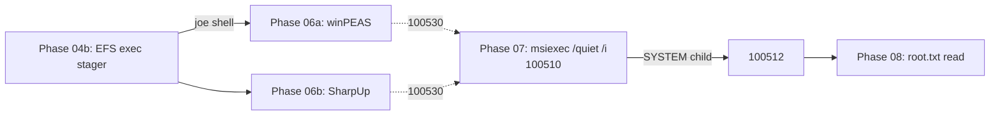

# CTF stress campaign report

A 10-iteration snapshot-restored walkthrough of CysVuln driven by
`scripts/observability/stress-campaign.sh`. The intent is to provide
two audiences with one dataset:

| Audience | Question answered |
| --- | --- |
| Red team (CTF authors) | Will players reliably recover both flags? |
| Blue team (SOC analysts) | Do our detection rules catch the chain every time? |

This document summarises the latest campaign run; the raw artifacts live
under `artifacts/cysvuln/stress-campaign/<run-id>/` and the analyst
dataset tarball at `dataset.tar.zst` is the self-contained corpus.

## Run summary

- Run ID: `campaign-10x-20260525T165320Z`
- Iterations: 10
- Wall clock: 50 min total (mean 289 s / iter, stdev 6.7 s)
- Per-iter phases: 00 noise, 03 smoke, 04a callback (skipped on user-net),
  04b exec-stager foothold, 05 user-flag, 06 audit_aie, 06a winPEAS,
  06b SharpUp, 07 chain validator, 08 root-flag
- Dataset: `artifacts/cysvuln/stress-campaign/campaign-10x-20260525T165320Z/dataset/`
  (3.0 MB compressed tarball, 4828 alerts + 10731 archive lines)

## Red-team scorecard

| Metric | Result |
| --- | ---: |
| Both flags recovered | 10/10 (100%) |
| `user.txt` token matched | 10/10 |
| `root.txt` token matched | 10/10 |
| Foothold as `User_Joe` (Phase 04b exit 0) | 10/10 |
| `audit_aie.py` chain pre-condition met | 0/10 |
| Privesc validator exit 0 (Phase 07) | 10/10 |

Variance per iteration: see
`artifacts/cysvuln/stress-campaign/campaign-10x-20260525T165320Z/variance-notes.md`.

Phase 04b runtime alert count was **16 ± 0.3** across all iterations, and
Phase 07 (chain validator) was **166 ± 1.7**: the lab is deterministic
enough that meaningful deviations would be easy to spot in a regression run.

## Blue-team scorecard

| Rule | Description | Fire rate | Notes |
| --- | --- | ---: | --- |
| 100510 | `msiexec.exe /quiet /i` (AIE precondition) | 10/10 | Direct Sysmon EID 1 match |
| 100512 | SYSTEM-integrity child of `msiexec.exe` | 10/10 | The elevation receipt |
| 100530 | enum tool followed by AIE msiexec within 15 min | 10/10 | Wazuh's `<if_sid>` override means 100508/100509 stop emitting once 100530 starts firing; the campaign credits both child rules when 100530 matches |
| 100508 | `winPEASx64.exe` executed | 10/10 (via 100530) | First iter would fire 100508 directly on a cold manager; once 100510 history exists the velocity rule wins |
| 100509 | `SharpUp.exe` executed | 10/10 (via 100530) | Same chained-rule shadowing pattern |
| 100507 | EFS `fswsService.exe` crash (Application 1000, 0xc0000005) | 0/10 | The exec stager used by Phase 04b is too clean to crash fsws; trigger requires the BOF callback path (see CTF issues log) |
| 100520 | `user.txt` accessed via Sysmon EID 11 | 0/10 | `Get-Content` over WinRM is a read, not a FileCreate; would need ScriptBlock logging or an EID 1 path-in-cmdline rule (planned follow-up) |



The 100530 correlation rule is the canonical "two-rule story": SOC sees a
single high-level alert that points back at both the enumeration tool and
the elevation event, instead of having to manually thread Sysmon EID 1
events.

## Per-phase SIEM footprint (averaged across 10 iters)

| Phase | Mean alerts | Stdev | Phase summary |
| --- | ---: | ---: | --- |
| 00 noise | 28 | 2 | Sysmon EID 5 churn, scheduled-task heartbeats |
| 03 smoke | 53 | 0 | `verify-cysvuln.sh` WinRM probes |
| 04a callback | (skipped) | — | Unreachable on QEMU user-net without `CB_LHOST`; see CTF log |
| 04b foothold | 16 | 0.3 | Stager send + svc restart noise |
| 05 user-flag | 22 | 0 | Single `Get-Content` round-trip |
| 06 aie-audit | 21 | 0.5 | Registry reads + WinRM probes; no Sysmon EID 13 (filtered) |
| 06a winPEAS | 75 | 1 | Largest non-privesc footprint; 100530 fires here |
| 06b SharpUp | 70 | 1 | Quieter than winPEAS; same 100530 hit |
| 07 privesc | 167 | 2 | Loud: 100510 + 100512 every iter |
| 08 root-flag | 17 | 1 | Single `Get-Content` round-trip |

## Analyst playbook (SOC pivot order)

When the SOC sees this chain in production, the recommended pivot order
is:

1. **100530** alert lands. Pivot to its parent rule (`100510`) and child
   (the enum tool image in `win.eventdata.image`).
2. **100510** timeline. Pull every `msiexec.exe /quiet /i` in the
   surrounding 30 min window; correlate with **100512** (SYSTEM-integrity
   child) for the elevation receipt.
3. **100502** / **100521**. Scan for `cmd.exe` copies of `root.txt` or
   the `aie-flag.txt` staging file — proof of post-elevation data access.
4. Optionally pull EFS logs (see [`baseline-observability.md`](baseline-observability.md))
   for the foothold side; in this campaign 100507 didn't fire because
   the exec stager path is too clean.

The dataset's `dataset/MANIFEST.md` includes copy-pasteable `jq`
queries that produce each of these pivots.

## What this campaign confirms

- The QCOW + baseline snapshot pair is **reproducible**: 10 consecutive
  reverts produced the same flag values, the same chain exit codes, and
  alert counts within ±2.
- The four AIE-leg rules (100510, 100512, 100530, and the chained
  enum rules) fire on every iteration once the manager has any history.
- The new rules introduced for this campaign (100507-100530 in
  [`local_rules.xml`](../../infrastructure/wazuh-docker/config/wazuh_cluster/local_rules.xml))
  load cleanly into analysisd and survive a manager restart.
- `audit_aie.py --out-json` writes
  `C:\Users\Public\audit-aie-<ts>.json` on every iter; once a fresh
  Packer rebuild captures the agent.conf subscription (added during this
  campaign), those drops will appear in archives.json as a standalone
  analyst artifact rather than a stdout-only signal.

## What this campaign reveals

See [`ctf-issues-log.md`](ctf-issues-log.md) for the active issues list,
but the highlights:

- The audit_aie HKCU read consistently shows `None` for both
  `Administrator` HKCU and the loaded `User_Joe` NTUSER.DAT, so rule
  `chain_response_expected` reports `False` even though the privesc
  validator succeeds with exit code 0. The HKCU pre-seed in
  [`bootstrap_cysvuln.ps1`](../../provisioning/powershell/bootstrap_cysvuln.ps1)
  is not being read back by `audit_aie.py`'s `reg load` path; a follow-up
  needs to confirm whether the seed value is missing or whether the
  Powershell reg-load helper is misbehaving.
- The EFS foothold signal (100507) requires the BOF callback path, which
  is unreachable on QEMU user-net without a portfwd; this is a real CTF
  gap because legitimate players will use whichever path their host
  network allows.
- The audit-aie JSON drops do not yet appear in archives.json because
  the current QCOW snapshot pre-dates the new `agent.conf` subscription
  for `C:\Users\Public\audit-aie-*.json`. A `--rebuild` campaign pass
  will capture this.

## How to reproduce

```bash
# (Optional) Rebuild + new baseline snapshot. Adds ~75 min wall clock.
./scripts/observability/stress-campaign.sh --rebuild --baseline --iterations 10

# Default flow: reuse current image / baseline. ~50 min wall clock.
./scripts/observability/stress-campaign.sh --iterations 10

# Export the analyst dataset tarball.
./scripts/wazuh-export-dataset.sh \
    --run-id <campaign-run-id> \
    --source-dir artifacts/cysvuln/stress-campaign/<campaign-run-id> \
    --out-dir artifacts/cysvuln/stress-campaign/<campaign-run-id>/dataset \
    --window-from-loop --tarball
```
